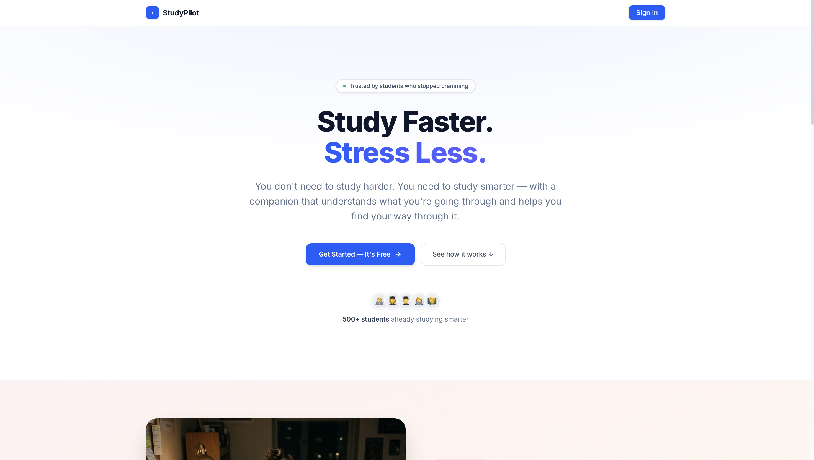
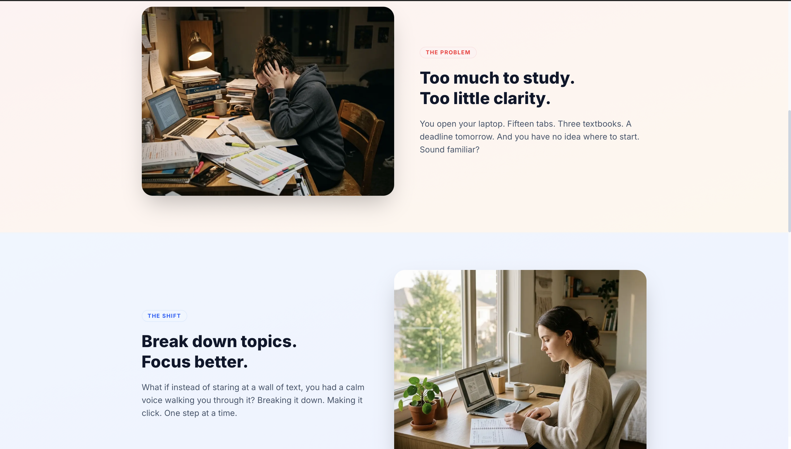
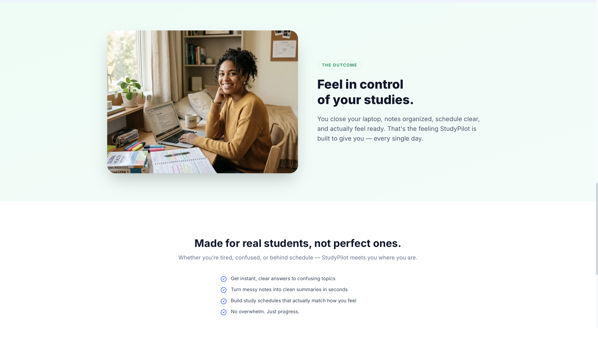
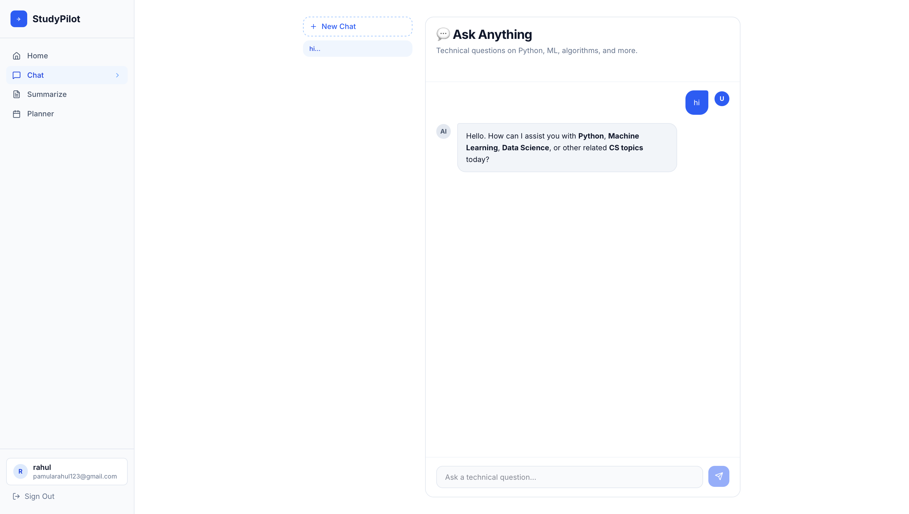
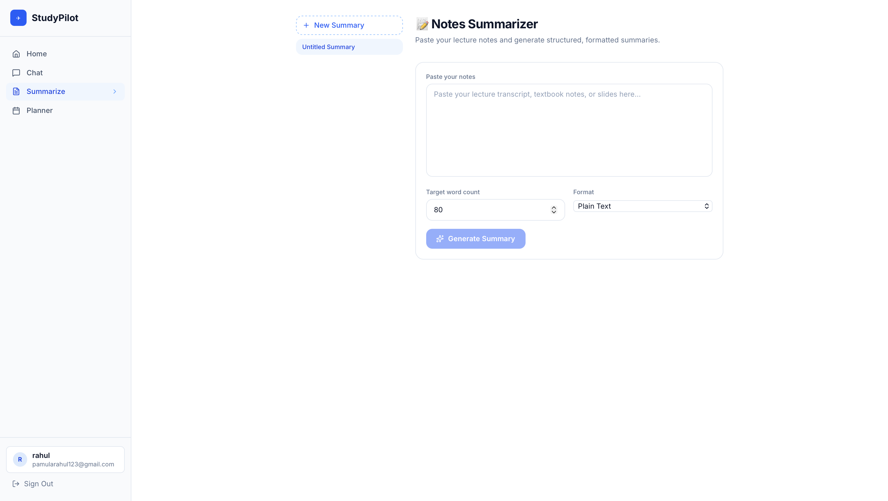
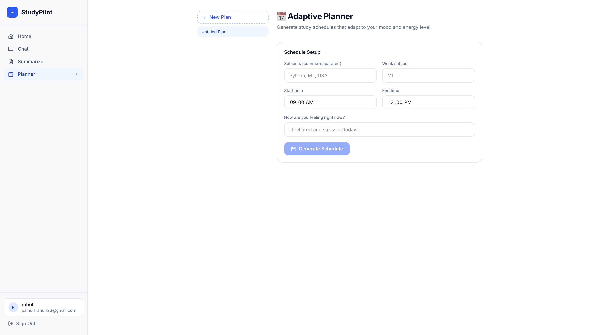
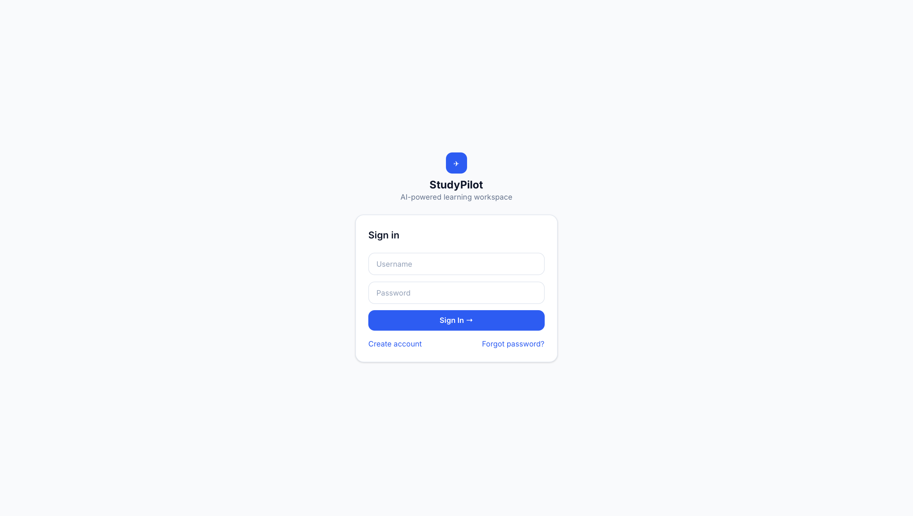

# ✈️ StudyPilot

StudyPilot is an AI-powered educational web application designed to help students optimize their learning experience. It combines a **technical chatbot**, a **multi-format notes summarizer**, and a **stress-adaptive study planner** in a custom-styled, premium light-themed interface.

The application operates seamlessly in both **online** (via the Groq API) and **offline** modes (falling back to local machine learning models and similarity-based algorithms). It is built with a modern decoupled architecture: a Next.js React frontend and a FastAPI backend.





---

## 🌟 Key Features

### 1. 💬 Ask Anything (Technical Chatbot)



A chatbot helper tailored to Python, Data Structures & Algorithms (DSA), OOP, and Machine Learning.
* **Smart Mode (Online):** Powered by the **Groq API** (`llama-3.3-70b-versatile`) to generate structured, markdown-rich answers with syntax-highlighted code blocks, lists, and tips.
* **Offline Fallback:** Employs a local **TF-IDF + Cosine Similarity** model mapped against a pre-loaded knowledge base of 100+ common questions.
* **Auto-Correction:** Automatically checks spelling typos in user queries using `difflib` before matching.
* **Sentiment Analysis:** Monitors the student's emotional state using **NLTK's VADER Sentiment Analyzer**. If a student appears stressed, the UI gives supportive real-time micro-feedback.

### 2. 📝 Notes Summarizer



Allows students to paste long lecture slides, documents, or articles and receive structured summaries.
* **Word Customization:** Customize the output length (between 10 to 1000 words).
* **Multiple Output Formats:** Formats summaries into *Plain Text*, *Bullet Points*, *Essay*, *Letter*, or *Email*.
* **Local Fallback:** Uses Hugging Face's local transformer pipeline (`transformers` with `t5-small`) to generate summary chunks offline when API keys are absent.

### 3. 📅 Adaptive Study Planner



A Pomodoro-style interactive study schedule that adapts dynamically to your mental state:
* **Mood Check-in:** Processes how you are feeling (e.g., *stressed*, *tired*, *excited*) through sentiment analysis.
* **Stress-Adaptive Intervals:**
  * **Gentle Mode (High Stress):** 20 min focus + 10 min recovery breaks.
  * **Mellow Mode (Mild Stress):** 25 min focus + 10 min breaks.
  * **Classic Mode (Healthy/Motivated):** 25 min focus + 5 min breaks.
* **Weak-Subject Weighting:** Prioritizes subjects by allocating double slots for your self-declared "Weak Subject".
* **Motivational Engine:** Delivers dynamic, mood-tailored quotes to push you through tough study sessions.

### 4. 🔑 Authentication & Security



* **SQLite Database:** Local user records, chat history, planner schedules, and note summaries are saved safely.
* **JWT Authentication:** Secure token-based authentication handles sessions seamlessly between the Next.js frontend and FastAPI backend.
* **Password Security:** Credentials are encrypted using SHA-256 before database storage.
* **OTP Verification:** Verification code emails are dispatched during signup and password recovery using Gmail's SMTP servers.

---

## 🛠️ Technology Stack

| Component | Technologies & Libraries |
| :--- | :--- |
| **Frontend UI** | [Next.js](https://nextjs.org/) (App Router), [Tailwind CSS v4](https://tailwindcss.com/), Framer Motion, Lucide Icons |
| **Backend API** | [FastAPI](https://fastapi.tiangolo.com/), Uvicorn, Python-Jose (JWT) |
| **Database** | [SQLite](https://www.sqlite.org/) |
| **AI LLM Engine (Online)** | [Groq API](https://groq.com/) (`llama-3.3-70b-versatile`) |
| **NLP & Local ML (Offline)** | `nltk` (VADER), `scikit-learn` (TF-IDF), `transformers` (T5-small via PyTorch), `difflib` |

---

## 🚀 Installation & Setup

You can run StudyPilot using Docker (recommended) or natively.

### Method 1: Docker (Recommended)
See [Docker Notes](docs/Docker_Notes.md) for full instructions.

1. Ensure Docker Desktop is installed.
2. Clone the repo and configure your `.env` inside `backend/`.
3. Run: `docker compose up --build -d`
4. Access the frontend at `http://localhost:3000` and API docs at `http://localhost:8000/docs`.

### Method 2: Manual Setup

#### Prerequisites
* Node.js v18+
* Python 3.10+
* Groq API Key & Gmail App Password (Optional but recommended for full features)

#### 1. Setup Backend
```bash
git clone https://github.com/Rahul-pamula/StudyPilot.git
cd StudyPilot/backend

# Create virtual environment and install deps
python -m venv venv
source venv/bin/activate  # On Windows: venv\Scripts\activate
pip install -r requirements.txt

# Create .env file (add GROQ_API_KEY, GMAIL_ADDRESS, GMAIL_APP_PASSWORD)
# Start the API
uvicorn src.api.main:app --reload --port 8000
```

#### 2. Setup Frontend
In a new terminal:
```bash
cd StudyPilot/frontend
npm install
npm run dev
```

Visit `http://localhost:3000` in your browser.

---

## 🎨 Theme & Visual Architecture
StudyPilot features a modern, clean, and emotional SaaS design:
* **Base styling:** Clean white backgrounds (`#FFFFFF`), subtle slate text colors, and premium blue-indigo gradients.
* **Typography:** Inter/system sans-serif fonts natively integrated through Tailwind.
* **Animations:** Smooth page transitions, fade-ins, and micro-interactions powered by Framer Motion.
* **Component Architecture:** Decoupled React components (Cards, ChatBubbles, Navbars) built for responsiveness and speed.
