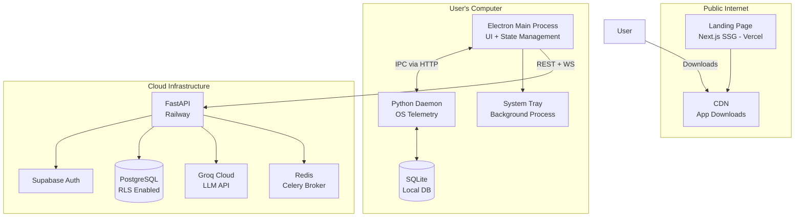
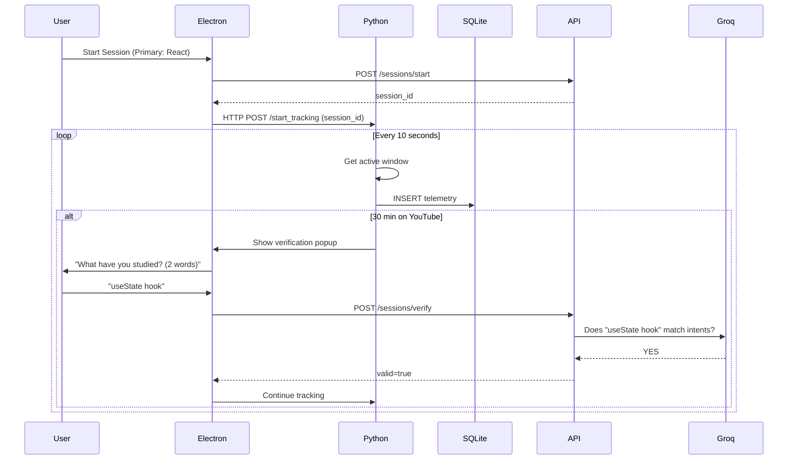

# VOLUME II: TECHNICAL ARCHITECTURE

## 3. System Architecture

### 3.1 High-Level Architecture Diagram



### 3.2 Technology Stack Matrix

| Component | Technology | Version | Hosting |
|-----------|------------|---------|---------|
| Landing Page | Next.js (SSG) | 14+ | Vercel (Hobby) |
| Desktop App | Electron | 28+ | Local installation |
| Desktop UI | React + TypeScript | 18+ | Bundled with Electron |
| Styling | TailwindCSS + Framer Motion | 3.3+ | - |
| State Management | Zustand | 4.4+ | - |
| Telemetry Daemon | Python | 3.11+ | Bundled with Electron |
| OS Detection (macOS) | pyobjc (AppKit) | 9.0+ | - |
| OS Detection (Windows) | pywin32 | 306+ | - |
| Backend API | FastAPI | 0.100+ | Railway |
| Database | PostgreSQL | 15+ | Neon (Railway) |
| Authentication | Supabase Auth | Latest | Supabase Cloud |
| LLM | Groq (Mixtral 8x7B) | - | Groq Cloud |

### 3.3 Component Responsibilities

#### Landing Page (Next.js)
- **Build:** Static Site Generation
- **Features:** Download buttons, feature showcase, testimonials

#### Desktop App (Electron)
- **Main Process:** Window management, IPC bridge, auto-updater
- **Renderer Process:** React UI, state management

#### Python Daemon
- **Process:** Background child process spawned by Electron
- **Permissions:** Requests screen recording (macOS) / accessibility (Windows)
- **Lifecycle:** Starts with OS, killed when tracking stops

#### FastAPI Backend
- **Authentication:** JWT validation with Supabase
- **Rate Limiting:** 100 requests/minute per user

### 3.4 Data Flow Architecture



---

## 4. Security & Privacy Architecture

### 4.1 Data Isolation Layers
#### Layer 1: Edge Processing (User's Computer)
- **Data Stored:** Raw telemetry (never leaves device)
- **Retention:** Auto-delete after 30 days

#### Layer 2: Cloud Aggregates (PostgreSQL)
- **Data Stored:** Daily focus scores, study streaks
- **Isolation:** Row Level Security (RLS) by `user_id`

### 4.2 Row Level Security Policies

```sql
CREATE POLICY "Session isolation by user_id"
    ON study_sessions FOR ALL
    USING (user_id = auth.uid());
```
