# VOLUME III: USER EXPERIENCE DESIGN

## 5. User Flows

### 5.1 Complete User Journey

```mermaid
graph LR
    A[Landing Page] -->|Download| B[Install App]
    B -->|First Launch| C[Permissions]
    C -->|Grant| D[Sign Up]
    D -->|Email/Google| E[Verify Email]
    E -->|Complete| F[Onboarding]
    F -->|Finish| G[Dashboard]
    G -->|Click| H[Start Focus Session]
    H -->|Set Intents| I[Active Tracking]
    I -->|Distraction| J[Verification Popup]
    J -->|2 Words| K[LLM Check]
    K -->|Valid| I
    K -->|Invalid| L[Penalty + Continue]
```



### 5.2 Onboarding Flow Details

#### Step 1: Welcome & Permissions (2 minutes)
- **Actions:** Click "Grant Permissions" button for Notifications/Screen Recording

#### Step 2: Student Context (3 minutes)
- **Form Fields:** Student Level, Institution, Primary Goal, Subjects

#### Step 3: Daily Commitment (2 minutes)
- **Interactive Elements:** Slider (30-480 minutes)

#### Step 4: Ready to Start (1 minute)
- **Action:** "Start First Session" button

---

## 6. UI Component Library

### 6.1 Design System Tokens

```css
:root {
  --bg-primary: #0A0A0A;
  --bg-secondary: #1A1A1A;
  --text-primary: #FFFFFF;
  --accent-blue: #3B82F6;
  --gradient-primary: linear-gradient(135deg, #3B82F6, #8B5CF6);
  --font-sans: 'Inter', sans-serif;
}
```

### 6.2 Core Components Specifications

#### FocusRing Component
- SVG circle with dashoffset animation (1s ease-out)
- Gradient stroke: Red(<40) → Yellow(40-70) → Green(>70)

#### StudyCard Component
- Glass morphism: backdrop-blur-xl, bg-white/5
- Hover: Scale 1.02, shadow-glow

---

## 7. Micro-interactions & Animations

### 7.1 Animation Library
| Element | Trigger | Animation | Duration | Easing |
|---------|---------|-----------|----------|--------|
| Page Transition | Route change | Fade + slide up | 300ms | ease-out |
| Toast Notification | Event trigger | Slide from top | 400ms | ease-out |

### 7.2 Notification System
#### Desktop Notification (OS Native)
- Title: "StudyPilot - [Context]"
- Body: Actionable message with emoji
- Actions: [Snooze] [View] [Dismiss]
