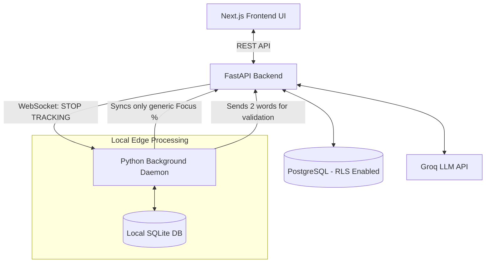

# High-Level Design (HLD): StudyPilot Digital Wellbeing Tracker

## 1. Executive Summary
The StudyPilot Digital Wellbeing Tracker is an advanced productivity ecosystem designed to eliminate student procrastination. It uses a **Privacy-First Edge Computing** model combined with **Enterprise-Grade Multi-Tenant Architecture** to track digital behavior, handle multi-tasking intents, and enforce "Honest & Genuine" deep work sessions.

---

## 2. System Architecture & Boundaries

The architecture is highly distributed, separating the Edge (user's PC) from the Cloud (StudyPilot infrastructure) to guarantee absolute data privacy and zero-lag performance.

### Component Diagram



### 2.1. StudyPilot Web App (Next.js)
* **Responsibility:** Multi-intent capture, onboarding, and displaying high-level analytics.
* **Master Switch:** Houses the global "Stop Tracking" toggle. When clicked, it terminates edge tracking immediately.

### 2.2. StudyPilot Backend (FastAPI)
* **Responsibility:** LLM Intent Validation and multi-tenant session routing.
* **Data Ownership:** Operates under strict **Data Isolation**. It never receives raw telemetry (no app names or logs).

### 2.3. Python Desktop Companion (Background Daemon)
* **Execution:** A zero-lag OS daemon that uses C-bindings (`AppKit`/`pywin32`) to check active windows in `<1ms`.
* **Kill-Switch Persistence:** Listens to a WebSockets channel. If the user clicks "Stop Tracking" on the web app, the daemon immediately suspends the monitoring thread and goes to sleep.

---

## 3. Multi-Tenant Architecture & Data Isolation

As a SaaS product serving multiple users simultaneously, StudyPilot implements strict enterprise-grade **Data Isolation** to prevent cross-tenant data leakage.

### 3.1 Logical Isolation via Schema
* We use a **Logical Database Isolation** pattern (Single Database, Shared Schema).
* Every table in PostgreSQL has a mandatory `user_id` (acting as the Tenant ID).

### 3.2 Row Level Security (RLS)
To mathematically guarantee that a bug in FastAPI cannot leak User A's focus scores to User B, PostgreSQL **Row Level Security (RLS)** is enforced at the database level.
* Example Policy:
  ```sql
  ALTER TABLE daily_focus_scores ENABLE ROW LEVEL SECURITY;
  CREATE POLICY tenant_isolation_policy ON daily_focus_scores 
  FOR ALL USING (user_id = current_setting('studypilot.current_user_id')::uuid);
  ```
* FastAPI injects the `current_user_id` into the Postgres connection pool at the start of every request.

---

## 4. Scalability & Edge-First Storage

All heavy data lifting happens on the Edge (the user's device).

* **Local DB (SQLite):** Lives at `~/.studypilot/local_telemetry.db`. Handles 100% of raw logs.
* **Auto-Cleanup (30-Day TTL):** A background chron job within the daemon deletes any row older than 30 days to save disk space.
* **Cloud DB (PostgreSQL):** Only stores the daily rolled-up Focus Score (e.g., `85%`) under strict RLS isolation.

---

## 5. Security & Extreme Privacy Guarantees

1. **Air-Gapped Telemetry:** Raw screen usage data **never leaves the user's computer**. The backend physically cannot access it.
2. **Explicit Opt-Out:** Tracking is not persistent by force. If the user stops the session in the app, the WebSockets trigger an immediate halt to the OS Daemon's polling cycle.
3. **Zero-Lag Architecture:** The daemon operates outside of the UI thread, ensuring zero impact on gaming or IDE workflows.
