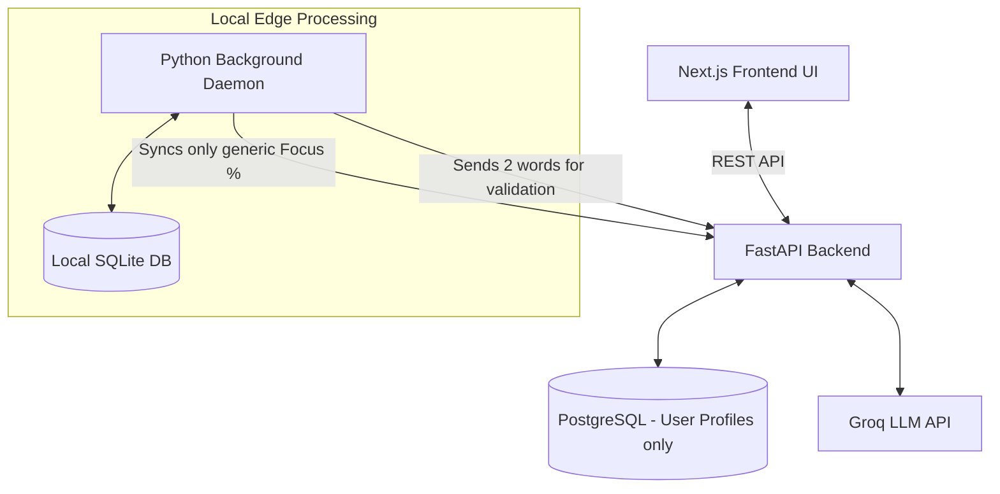

# High-Level Design (HLD): StudyPilot Digital Wellbeing Tracker

## 1. Overview
The StudyPilot Digital Wellbeing Tracker is an advanced productivity ecosystem designed to eliminate student procrastination through "Honest & Genuine" micro-interventions. It moves beyond standard time-blocking by tracking actual digital behavior, enforcing intent, and providing empathetic nudges.

## 2. System Architecture
The architecture is designed as a distributed system with strict boundaries between the frontend interface, the backend processing engine, and the local telemetry client.

### Component Diagram

## 3. System Boundaries & Responsibilities

### 3.1. StudyPilot Web App (Next.js)
* **Responsibility:** User Onboarding, Analytics display, and Intent Capture.
* **Data Ownership:** Fetches the aggregated, privacy-safe Focus Scores from the backend.

### 3.2. StudyPilot Backend (FastAPI)
* **Responsibility:** LLM Intent Validation and syncing high-level Focus Scores.
* **Data Ownership:** Owns only basic user profiles and high-level stats (e.g., "Daily Focus: 85%"). **NEVER receives or stores raw app telemetry (no Instagram/YouTube logs).**

### 3.3. Python Desktop Companion (Background Daemon)
* **Responsibility:** A highly optimized, invisible background service that runs on the user's OS.
* **Execution (Zero-Lag):** Written in low-level OS APIs (C-bindings via PyObjC/PyWin32). Sleeps heavily and only wakes up every 10 seconds for `< 1ms` to check the window title, guaranteeing **zero lag** or battery drain.
* **Persistence:** Runs as an OS Daemon (macOS `launchd` or Windows Service). It continues monitoring even if the main UI application is closed.
* **Data Ownership:** Stores all sensitive telemetry in a local, encrypted SQLite file on the user's hard drive.

## 4. Scalability & Edge-First Storage

Instead of sending 10-second heartbeats to a cloud database (which wastes bandwidth and violates privacy), all heavy lifting happens on the Edge (the user's device).

* **Local DB (SQLite):** Lives at `~/.studypilot/local_telemetry.db`. Handles 100% of the raw app logs locally.
* **Auto-Cleanup (30-Day TTL):** A background chron job within the daemon automatically deletes any local row older than 30 days to save disk space.
* **Cloud DB (PostgreSQL):** Only stores the daily rolled-up Focus Score (e.g., `User A: 85% on Monday`) so the user can see their progress on the web dashboard.

## 5. Security & Extreme Privacy Guarantees
StudyPilot's core marketing promise is **"Local-First Privacy."**

1. **Air-Gapped Telemetry:** Raw screen usage data (e.g., "YouTube - React Tutorial", "Instagram") **never leaves the user's computer**. The backend physically cannot access it.
2. **Zero-Lag Architecture:** The daemon operates outside of the UI thread, utilizing native OS hooks to ensure zero impact on gaming or heavy IDE workflows.
3. **Unkillable Background Monitoring:** The tracker installs as a system background service. Even if the user clicks "X" on the StudyPilot companion app window, the daemon continues holding them accountable.
