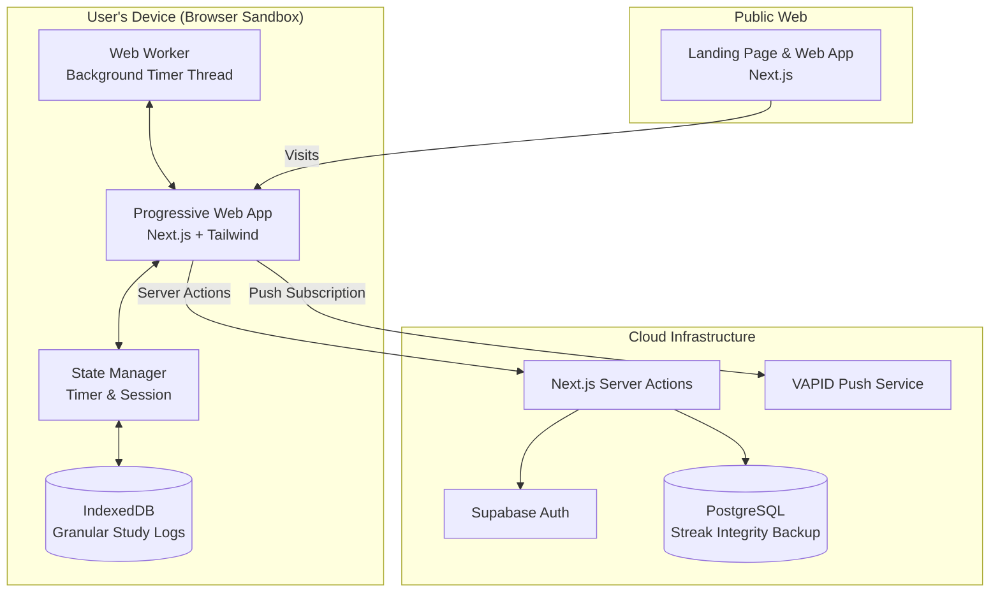

# PART A: HIGH-LEVEL DESIGN (PWA Architecture)

## A.1 System Overview
StudyPilot is a **mobile-first Progressive Web App (PWA)**. By operating exclusively within the browser, it enforces a privacy-by-design model while delivering a native-app experience across devices.

### Deployment Matrix

| Component | Platform | Tech Stack | Distribution |
|-----------|----------|------------|--------------|
| Web App / PWA | Any Browser | Next.js 14 (App Router) | Vercel (Web) / "Add to Home Screen" |
| Backend API | Cloud | Next.js Server Actions | Vercel |
| Database | Cloud | Supabase (PostgreSQL) | Supabase Cloud |
| Local Storage | Edge (Device) | IndexedDB / `localStorage` | Zero-latency local caching |

### System Architecture Diagram



---

## A.2 The Bulletproof Timer Architecture

Mobile and desktop browsers aggressively throttle JavaScript in background tabs to save battery. A naive `setInterval` or `Date.now()` implementation will fail under real-world conditions.

StudyPilot employs a multi-layered defense to ensure timer integrity:

1. **Web Workers:** The core countdown logic runs in a separate Web Worker thread, which is less susceptible to main-thread UI freezing.
2. **BroadcastChannel API:** If a user opens StudyPilot in three different tabs, the BroadcastChannel API synchronizes the timer state across all instances in real-time.
3. **Wake Lock API:** For desktop users, the app requests a `Screen Wake Lock` to prevent the monitor from sleeping during an active focus session.
4. **Server-Side Heartbeat:** For critical sessions, periodic lightweight pings are sent to the backend to reconcile time drift if the device was fully suspended (e.g., closing a laptop lid).

---

## A.3 Progressive Web App (PWA) Standards

To ensure StudyPilot behaves exactly like a native app on iOS and Android, the `manifest.json` and meta tags strictly adhere to PWA standards:

```json
{
  "name": "StudyPilot",
  "short_name": "StudyPilot",
  "display": "standalone",
  "orientation": "portrait",
  "background_color": "#000000",
  "theme_color": "#1e3a8a"
}
```
*Crucially, `"display": "standalone"` ensures the browser URL bar is hidden when launched from the Home Screen.*
