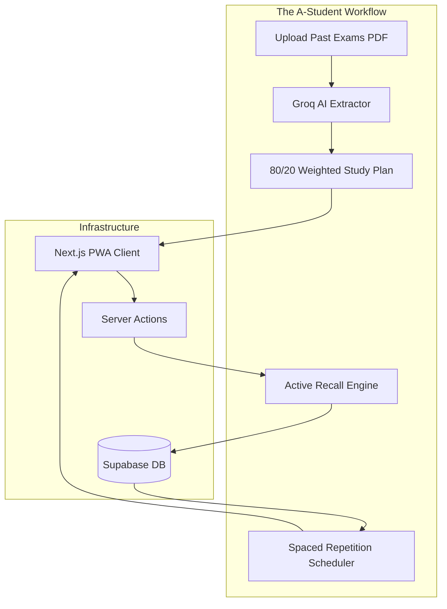

# PART A: HIGH-LEVEL DESIGN (The A-Student OS)

## A.1 System Overview
StudyPilot V3 is no longer a time-tracking application. It is an **AI-Powered Active Recall and Exam Strategy Platform**. It operates on the fundamental academic truth that *quality* of study (retention, high-yield focus, sleep) is infinitely more valuable than *quantity* (minutes studied).

### Core Features
1. **Past Exam Analyzer:** AI extraction of 80/20 high-yield topics from uploaded PDFs.
2. **Active Recall Engine:** Mandatory AI-generated flashcards/write-ups at the end of study sessions.
3. **Forgetting Curve Tracker:** Automated scheduling for spaced repetition.

### Deployment Matrix

| Component | Platform | Tech Stack | Distribution |
|-----------|----------|------------|--------------|
| Web App / PWA | Any Browser | Next.js 14 (App Router) | Vercel (Web) / "Add to Home Screen" |
| AI PDF Parser | Edge | Groq API (Mixtral 8x7B) + Langchain | Cloud Processing |
| Database | Cloud | Supabase (PostgreSQL) | Supabase Cloud |

### System Architecture Diagram



---

## A.2 The Active Recall Engine Architecture

To enforce active recall, StudyPilot employs a strict verification gate:
1. A student studies a topic (e.g., "Thermodynamics").
2. The user clicks "Log Session".
3. The Next.js API requests 3 rapid-fire questions from Groq about Thermodynamics.
4. The user must type their answers.
5. Groq evaluates the answers. **If the user fails, the session is discarded as "Passive Study."** If they pass, it is logged, and the topic enters the Spaced Repetition schedule.

---

## A.3 Technology Stack Details

```yaml
Framework: Next.js 14 (App Router)
AI Integration: Groq API (Incredible speed required for real-time recall questions)
File Handling: Next.js API Routes for PDF parsing (pdf-parse)
Styling: TailwindCSS + Shadcn UI
Database: Supabase (PostgreSQL)
```
