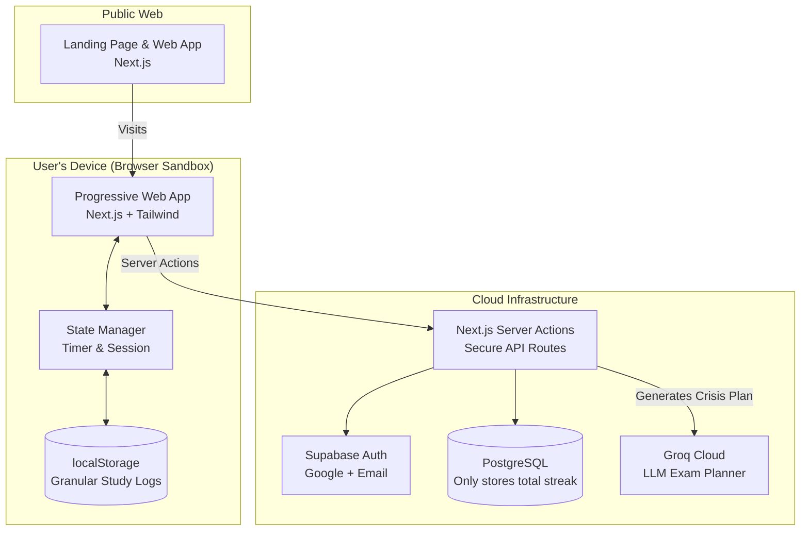

# PART A: HIGH-LEVEL DESIGN (PWA Architecture)

## A.1 System Overview
StudyPilot is a **mobile-first Progressive Web App (PWA)**. By operating exclusively within the browser, it enforces a strict zero-data storage privacy model while delivering a native-app experience on iOS, Android, and Desktop.

### Deployment Matrix

| Component | Platform | Tech Stack | Distribution |
|-----------|----------|------------|--------------|
| Web App / PWA | Any Browser | Next.js 14 (App Router) | Vercel (Web) / "Add to Home Screen" |
| Backend API | Cloud | Next.js Server Actions | Vercel |
| Database | Cloud | Supabase (PostgreSQL) | Supabase Cloud |
| Authentication | Cloud | Supabase Auth | - |
| Local Storage | Edge (Device) | IndexedDB / `localStorage` | Zero-latency local caching |

### System Architecture Diagram



---

## A.2 Technology Stack Details

### Frontend & PWA Framework
```yaml
Framework: Next.js 14 (App Router)
PWA Support: next-pwa (Service Workers + Offline Cache)
UI Library: React 18 + TypeScript
Styling: TailwindCSS + Framer Motion (animations)
State Management: Zustand (persisted locally)
Component Library: Shadcn UI
Icons: Lucide React
```

### Backend & AI Infrastructure
```yaml
Backend Environment: Next.js Server Actions (Edge/Node)
Database: Supabase (PostgreSQL) - strictly for cross-device authentication and streaks
Authentication: Supabase Auth (JWT validation)
LLM Provider: Groq API (Mixtral 8x7B) for high-speed study scheduling
```

---

## A.3 The PWA Advantage

### Browser Sandboxing
By running as a PWA, StudyPilot physically cannot spy on other applications. It is strictly limited by browser security, building immediate trust with students.

### Background Throttling Defense
Mobile browsers freeze JavaScript when minimized. The StudyPilot Pomodoro Timer engine relies on absolute `Date.now()` timestamp differences instead of `setInterval()`, ensuring time is never lost when the user checks a text message.
