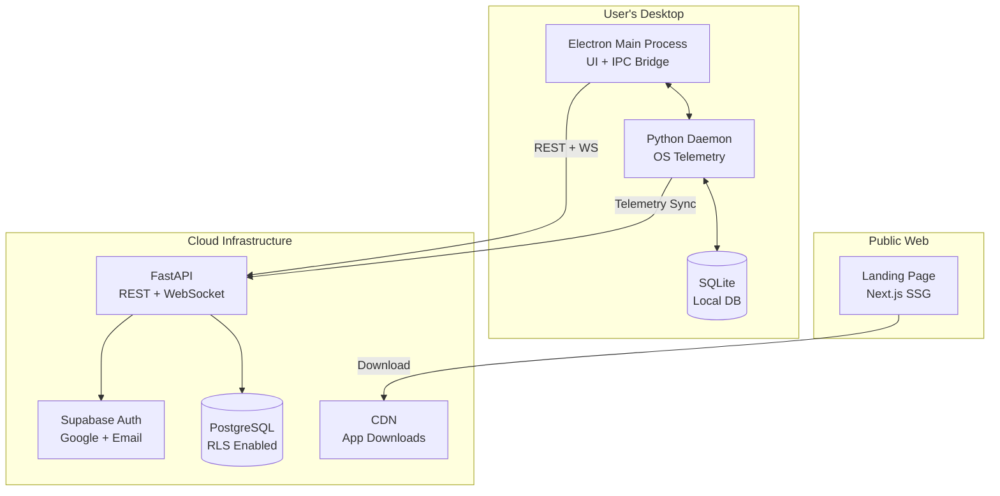

# PART A: HIGH-LEVEL DESIGN (System Architecture)

## A.1 System Overview
StudyPilot is a **cross-platform desktop application** with a web presence, combining edge-native tracking with cloud sync.

### Deployment Matrix

| Component | Platform | Tech Stack | Distribution |
|-----------|----------|------------|--------------|
| Landing Page | Web | Next.js (SSG) | Vercel/Cloudflare Pages |
| Desktop App | Windows/macOS/Linux | Electron + Python daemon | Direct download (.exe/.dmg/.AppImage) |
| Backend API | Cloud | FastAPI | Railway/DigitalOcean |
| Database | Cloud | PostgreSQL | Neon/Timescale |
| Authentication | Cloud | Supabase Auth / Auth0 | - |

### System Architecture Diagram



---

## A.2 Technology Stack Details

### Frontend (Electron Desktop App)
```yaml
Framework: Electron 28+
UI Library: React 18 + TypeScript
Styling: TailwindCSS + Framer Motion (animations)
State Management: Zustand (persisted locally)
Component Library: Radix UI (accessible, headless)
Icons: Lucide React
Notifications: Electron Notification API
```

### Backend (FastAPI Cloud)
```yaml
Framework: FastAPI 0.100+
ORM: SQLAlchemy 2.0 + Alembic
Auth: Supabase Auth (JWT validation)
Background Tasks: Celery + Redis
Rate Limiting: SlowAPI
CORS: Configured for desktop app origin
```

### Desktop Daemon (Python)
```yaml
Language: Python 3.11+
Packaging: PyInstaller (bundled with Electron)
OS APIs: 
  - macOS: pyobjc (AppKit)
  - Windows: pywin32
  - Linux: python-xlib
IPC: HTTP localhost:8765 (Electron ↔ Python)
```
