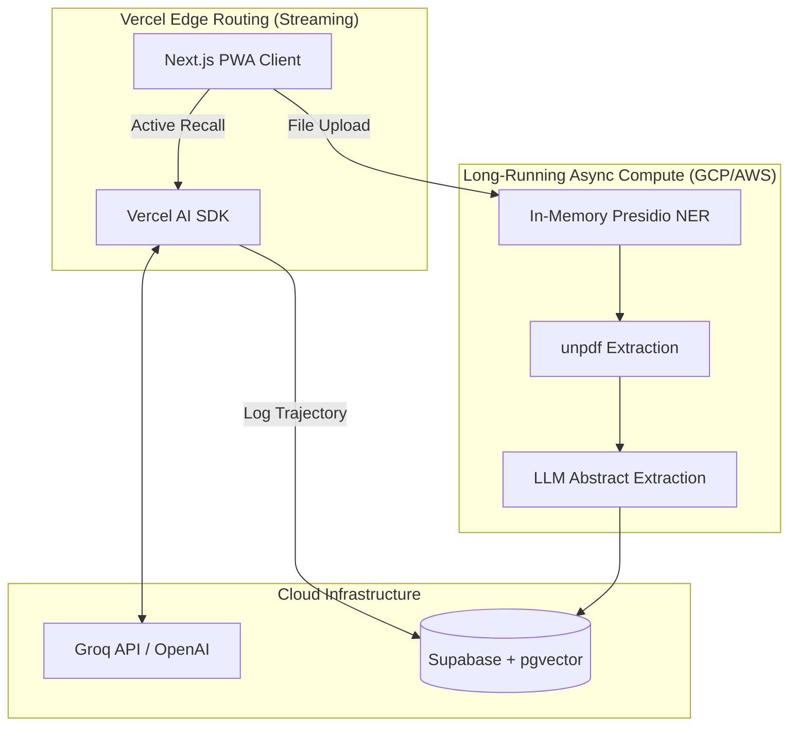

# PART A: HIGH-LEVEL DESIGN (Enterprise Architecture)

## A.1 System Overview
StudyPilot V4 is an Enterprise-Grade Educational AI Platform. It abandons isolated flashcards and basic timers in favor of semantic knowledge graphs, strict compliance pipelines, and dynamically adjusting spaced repetition driven by cognitive psychology principles.

### Deployment Matrix

| Component | Platform | Tech Stack | Distribution |
|-----------|----------|------------|--------------|
| Web App / PWA | Any Browser | Next.js 14 (App Router) | Vercel (Web) / "Add to Home Screen" |
| Edge AI Streaming | Vercel Edge | Vercel AI SDK (67.5 kB) | High-concurrency edge nodes |
| Database & Vector | Cloud | Supabase (PostgreSQL + pgvector) | Supabase Cloud |
| Document Ingestion | GCP / AWS VM | unpdf + Presidio (NER) | Isolated long-running compute |

### System Architecture Diagram

---

## A.2 Resolving Serverless Constraints

Deploying heavy LLM orchestration entirely within a Next.js serverless environment introduces critical constraints regarding payload limits, timeouts, and bundle sizing.

### The Dependency Shift
StudyPilot explicitly **rejects** the use of `LangChain JS` and `pdf-parse`.
- `LangChain JS` carries a massive bundle size and relies on Node.js core modules (`fs`, `eval`) that instantly crash Vercel's isolated Edge Runtime.
- `pdf-parse` relies on native C++ bindings that fail to compile or execute within serverless constraints.

**The Solution:**
StudyPilot exclusively utilizes the **Vercel AI SDK** (~67.5 kB) for optimized edge streaming (achieving ~30ms latency) and `unpdf`, a dependency-free engine for native document extraction.

---

## A.3 The Pedagogical Engine: Desirable Difficulties

StudyPilot operates on the "testing effect." The platform does **not** discard failed active recall sessions. The physical act of attempting to retrieve information—even if the final answer is incorrect—strengthens neural pathways. 

Every retrieval attempt, successful or failed, is aggressively logged. Failures are dynamically used to shorten the next review interval rather than purging the study history, preventing the 70% 24-hour decay rate defined by cognitive research.
