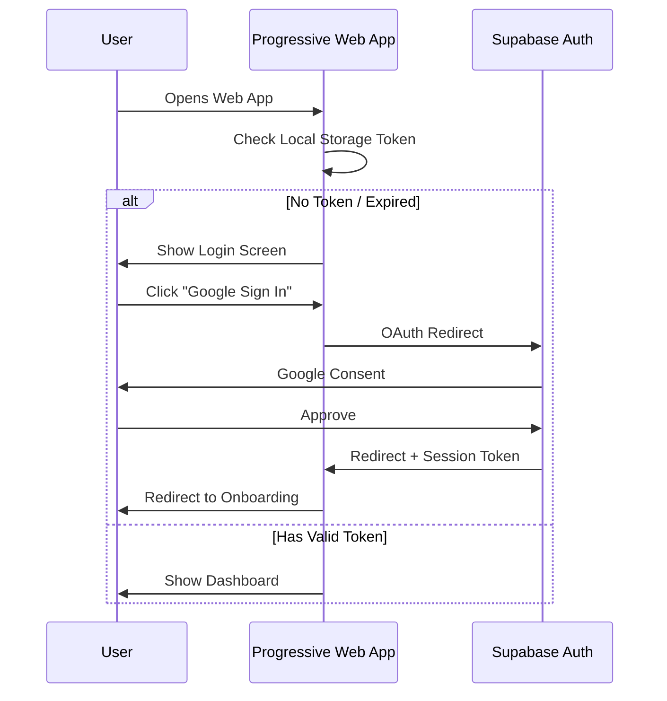

# PART B: AUTHENTICATION & ONBOARDING (LLD)

## B.1 Authentication Flow

### B.1.1 User Journey



### B.1.2 Database Schema (Auth)

```sql
-- Supabase Auth manages: users, identities, sessions
-- We only store basic non-sensitive information in the cloud

CREATE TABLE public.profiles (
    id UUID PRIMARY KEY REFERENCES auth.users(id) ON DELETE CASCADE,
    full_name VARCHAR(100),
    avatar_url TEXT,
    study_streak INT DEFAULT 0,
    created_at TIMESTAMPTZ DEFAULT NOW(),
    updated_at TIMESTAMPTZ DEFAULT NOW()
);

-- Enable RLS
ALTER TABLE public.profiles ENABLE ROW LEVEL SECURITY;

-- Policies
CREATE POLICY "Users can view own profile"
    ON profiles FOR SELECT USING (auth.uid() = id);
    
CREATE POLICY "Users can update own profile"
    ON profiles FOR UPDATE USING (auth.uid() = id);
```

---

## B.2 Onboarding Flow (4-Step)

### Step 1: Welcome
```typescript
// OnboardingStep1.tsx
const Step1 = () => (
  <div className="space-y-6 text-center">
    <motion.div animate={{ scale: [0.9, 1] }} className="text-6xl">🎓</motion.div>
    <h1 className="text-3xl font-bold">Welcome to StudyPilot</h1>
    <p className="text-gray-400">The timer that builds discipline without spying on you.</p>
    
    <Button onClick={nextStep}>Continue →</Button>
  </div>
);
```

### Step 2: Study Context
```typescript
// OnboardingStep2.tsx
const studyLevels = [
  { value: 'high_school', label: '🏫 High School', color: '#10B981' },
  { value: 'undergrad', label: '📚 Undergraduate', color: '#3B82F6' },
  { value: 'graduate', label: '🎓 Graduate', color: '#8B5CF6' }
];

<Select options={studyLevels} placeholder="Select your level" />
<Textarea placeholder="What's your biggest study challenge?" />
```

### Step 3: Commitment & Notifications
```typescript
// OnboardingStep3.tsx - Requesting PWA capabilities
const requestNotifications = async () => {
  if ('Notification' in window) {
    const permission = await Notification.requestPermission();
    if (permission === 'granted') {
      toast.success("Alerts enabled!");
    }
  }
};

<div className="space-y-4">
  <p>Enable browser notifications to hear the timer ring when you are in another tab.</p>
  <Button onClick={requestNotifications}>Enable Notifications 🔔</Button>
</div>
```

### Step 4: Add to Home Screen (PWA Hook)
```typescript
// OnboardingStep4.tsx
<div className="text-center space-y-4">
  <h2>Install StudyPilot</h2>
  <p>For the best experience, add StudyPilot to your home screen.</p>
  <div className="bg-gray-800 p-4 rounded-lg">
    <p className="text-sm">Tap the <b>Share</b> icon below and select <b>Add to Home Screen</b>.</p>
  </div>
  <Button onClick={completeOnboarding}>Start First Session</Button>
</div>
```
