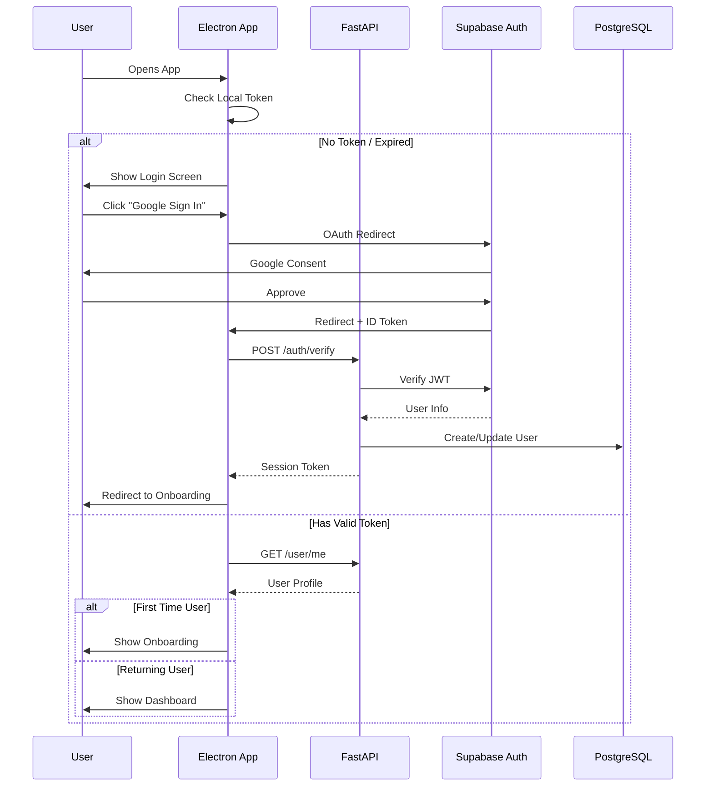

# PART B: AUTHENTICATION & ONBOARDING (LLD)

## B.1 Authentication Flow

### B.1.1 User Journey



### B.1.2 Database Schema (Auth)

```sql
-- Supabase Auth manages: users, identities, sessions
-- Extended profile table (RLS protected)

CREATE TABLE public.profiles (
    id UUID PRIMARY KEY REFERENCES auth.users(id) ON DELETE CASCADE,
    full_name VARCHAR(100),
    avatar_url TEXT,
    student_level VARCHAR(50), -- 'high_school', 'undergrad', 'graduate'
    institution VARCHAR(200),
    study_goal TEXT, -- "Master React by June"
    daily_study_target_mins INT DEFAULT 120,
    email_notifications BOOLEAN DEFAULT true,
    desktop_notifications BOOLEAN DEFAULT true,
    created_at TIMESTAMPTZ DEFAULT NOW(),
    updated_at TIMESTAMPTZ DEFAULT NOW()
);

-- Enable RLS
ALTER TABLE public.profiles ENABLE ROW LEVEL SECURITY;

-- Policies
CREATE POLICY "Users can view own profile"
    ON profiles FOR SELECT USING (auth.uid() = id);
    
CREATE POLICY "Users can update own profile"
    ON profiles FOR UPDATE USING (auth.uid() = id);
```

### B.1.3 API Endpoints (Auth)

```python
# FastAPI routes
@router.post("/auth/verify")
async def verify_supabase_token(token: str, db: Session):
    """Verify Supabase JWT and sync user profile"""
    user = supabase.auth.get_user(token)
    profile = db.query(Profile).filter_by(id=user.id).first()
    if not profile:
        profile = Profile(id=user.id, full_name=user.user_metadata['full_name'])
        db.add(profile)
        db.commit()
    return {"session_token": create_session_token(user.id)}

@router.get("/user/me")
async def get_me(current_user: User = Depends(get_current_user)):
    return current_user.profile

@router.put("/user/me")
async def update_profile(update: ProfileUpdate, current_user: User = Depends(get_current_user)):
    for key, value in update.dict(exclude_unset=True).items():
        setattr(current_user.profile, key, value)
    db.commit()
    return current_user.profile
```

---

## B.2 Onboarding Flow (4-Step)

### Step 1: Welcome & Permissions
```typescript
// OnboardingStep1.tsx
const Step1 = () => (
  <div className="space-y-6 text-center">
    <motion.div animate={{ scale: [0.9, 1] }} className="text-6xl">
      🎓
    </motion.div>
    <h1 className="text-3xl font-bold">Welcome to StudyPilot</h1>
    <p className="text-gray-400">Your AI study companion that actually works</p>
    
    <div className="bg-gray-800/50 p-4 rounded-lg text-left space-y-3">
      <div className="flex items-center gap-3">
        <ShieldCheck className="text-green-500" />
        <span>Your data stays private. We never sell it.</span>
      </div>
      <div className="flex items-center gap-3">
        <Bell className="text-blue-500" />
        <span>We'll ask for notification permissions next</span>
      </div>
    </div>
    
    <Button onClick={requestPermissions}>Continue →</Button>
  </div>
);
```

### Step 2: Study Context
```typescript
// OnboardingStep2.tsx - Beautiful form with autocomplete
const studyLevels = [
  { value: 'high_school', label: '🏫 High School', color: '#10B981' },
  { value: 'undergrad', label: '📚 Undergraduate', color: '#3B82F6' },
  { value: 'graduate', label: '🎓 Graduate', color: '#8B5CF6' },
  { value: 'self_taught', label: '💻 Self-Taught', color: '#F59E0B' }
];

<Select options={studyLevels} placeholder="Select your level" />
<Input placeholder="University/College name (optional)" />
<Textarea placeholder="What's your biggest study challenge?" />
```

### Step 3: Study Goals & Commitment
```typescript
// OnboardingStep3.tsx - Interactive goal setting
const [dailyTarget, setDailyTarget] = useState(120);

<Slider
  value={[dailyTarget]}
  onValueChange={(v) => setDailyTarget(v[0])}
  min={30}
  max={480}
  step={15}
  className="my-6"
/>
<div className="flex justify-between text-sm">
  <span>🐢 30 min</span>
  <span>⚡ {dailyTarget} min/day</span>
  <span>🏃 8 hours</span>
</div>

// Commitment pledge with animation
<motion.div 
  whileHover={{ scale: 1.02 }}
  className="border-2 border-blue-500/30 rounded-lg p-4 cursor-pointer"
  onClick={signPledge}
>
  <div className="flex items-center gap-2">
    <Signature /> I commit to honest tracking
  </div>
</motion.div>
```

### Step 4: App Permissions (OS Level)
```typescript
// Step4: System permission requests
const requestSystemPermissions = async () => {
  // macOS: Screen Recording permission
  if (process.platform === 'darwin') {
    await ipcRenderer.invoke('request-screen-recording-permission');
  }
  
  // Windows: Accessibility permission
  if (process.platform === 'win32') {
    await ipcRenderer.invoke('request-accessibility-permission');
  }
  
  // Notifications
  await Notification.requestPermission();
  
  // Complete onboarding
  await api.post('/user/onboarding-complete');
};
```
