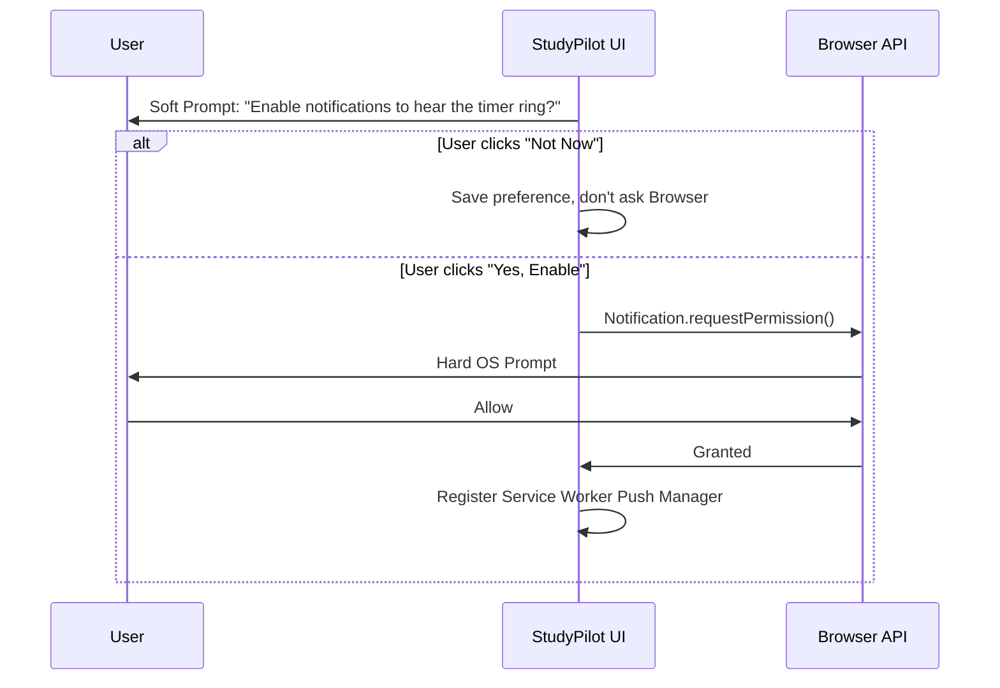

# PART B: AUTHENTICATION & DATABASE SCHEMA (LLD)

## B.1 Database Schema: Streak Integrity

A critical flaw in gamification systems is relying on local storage or mutable integer counters for streaks. If a user clears their Safari history, a local streak is destroyed. If multiple devices update an integer simultaneously, race conditions occur.

**Solution:** The database stores absolute timestamps, and streaks are calculated on read.

```sql
-- Profiles table for streak integrity
CREATE TABLE public.profiles (
    id UUID PRIMARY KEY REFERENCES auth.users(id) ON DELETE CASCADE,
    email VARCHAR(255) NOT NULL,
    full_name VARCHAR(100),
    avatar_url TEXT,
    
    -- Streak Integrity Fields
    last_study_date DATE,
    daily_goal_hit BOOLEAN DEFAULT false,
    streak_version INT DEFAULT 1, -- For optimistic concurrency control
    
    created_at TIMESTAMPTZ DEFAULT NOW(),
    updated_at TIMESTAMPTZ DEFAULT NOW()
);

-- Enable RLS
ALTER TABLE public.profiles ENABLE ROW LEVEL SECURITY;
```

---

## B.2 Authentication Flow

StudyPilot uses Supabase Auth (Google OAuth + Email Magic Links).

Because Supabase Auth relies on secure, HTTP-only cookies to maintain session state, and because StudyPilot operates in jurisdictions covered by the ePrivacy Directive (GDPR), **explicit cookie consent is required during onboarding.**

### B.2.1 Onboarding & Web Push Implementation

Web Push notifications are not a magic bullet. They require explicit VAPID key architecture and careful permission prompting.

**The Strategy:** Browsers only allow an app to request Notification permissions *once*. If the user clicks "Deny", they must dig into browser settings to undo it. Therefore, StudyPilot uses a "Soft Prompt" first.


