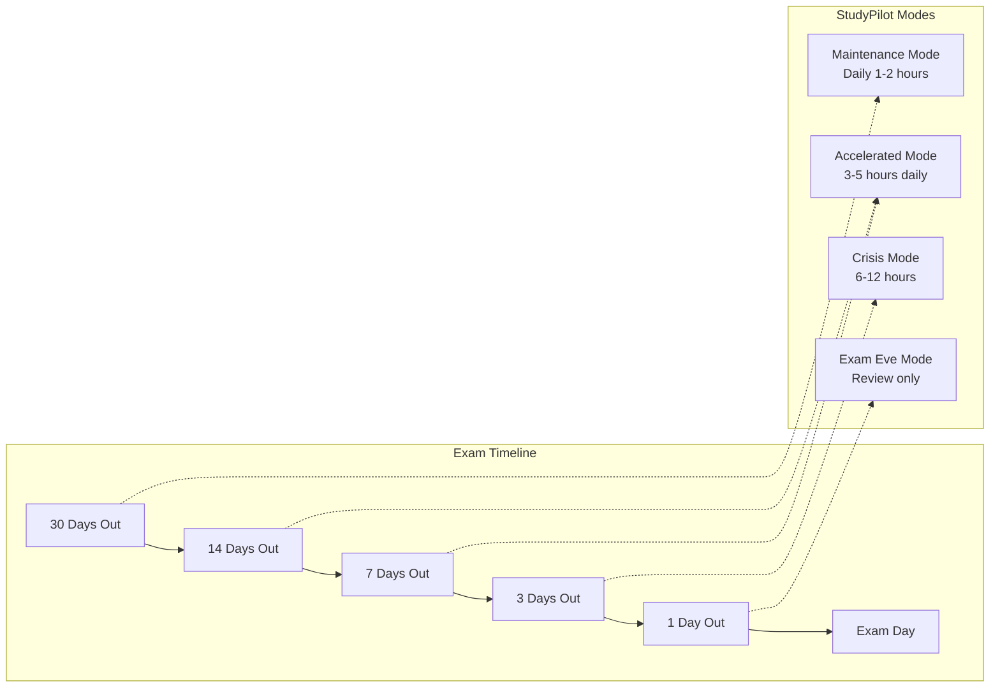
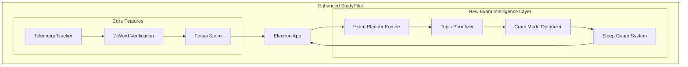

# PART H: EXAM CRISIS MODE & ADAPTIVE STUDY INTELLIGENCE
## Complete Feature Architecture for Last-Minute Learners

---

## 1. User Personas & Behavioral Patterns

### 1.1 Target User Segmentation

#### Persona A: "The Crammer" (60% of target users)
- **Behavior:** Studies 1-2 days before exam
- **Session length:** 4-8 hours straight
- **Pain points:** High anxiety, poor retention, all-nighters
- **Motivation:** Fear of failure, adrenaline-driven
- **StudyPilot Angle:** "Make every minute count"

#### Persona B: "The Panic Starter" (25% of target users)
- **Behavior:** Starts 1 week before, studies inconsistently
- **Session length:** 2-3 hours, with frequent breaks
- **Pain points:** Procrastination, lack of structure
- **Motivation:** "I should have started earlier"
- **StudyPilot Angle:** "Build momentum before crisis"

#### Persona C: "The Consistent Student" (15% of target users)
- **Behavior:** Studies daily, exam is just another day
- **Session length:** 1-2 hours daily
- **Pain points:** Boredom, plateauing performance
- **Motivation:** Maintaining streak
- **StudyPilot Angle:** "Optimize peak performance"

---

## 2. Exam Timeline & Feature Mapping



---

## 3. Feature Matrix by Exam Timeline

| Days Until Exam | Primary Mode | Key Features | Focus Score Target | Break Pattern |
|----------------|--------------|--------------|-------------------|---------------|
| 30-15 | Maintenance | Smart scheduling, Habit building | >70% | Pomodoro (25/5) |
| 14-8 | Accelerated | Topic prioritization, Weak spot detection | >65% | 50/10 |
| 7-4 | Intensive | Flashcard generation, Practice test mode | >60% | 90/15 |
| 3-1 | Crisis | Emergency checklist, Sleep guard, Panic button | >50% | 120/30 |
| 1 | Exam Eve | Review only, No new topics, Anxiety management | No tracking | As needed |

---

## 4. Detailed Feature Specifications

### 4.1 Exam Intake & Planning (New Onboarding Step)

**Feature:** "Exam Blueprint" - Set up your exam timeline

**User Input:**
```json
{
  "exam_name": "Final Calculus Exam",
  "exam_date": "2026-06-15",
  "exam_weight": 40,
  "current_readiness": 3,
  "topics_to_cover": [
    {"name": "Derivatives", "confidence": "low", "weight": 30},
    {"name": "Integrals", "confidence": "medium", "weight": 40},
    {"name": "Limits", "confidence": "high", "weight": 30}
  ],
  "study_hours_available": {
    "weekdays": 4,
    "weekends": 8
  }
}
```

**AI-Generated Study Plan:**
```text
Based on 14 days until exam:
- Priority Topics: Derivatives (low confidence, 30% weight)
- Daily target: 5.2 hours
- Recommended mode: Accelerated
- Suggested schedule: 2 hours morning, 3 hours evening
- Break every 50 minutes
```

### 4.2 Smart Topic Prioritization Engine

**Algorithm:**
```python
def calculate_topic_priority(confidence, weight, days_left):
    """
    Priority = (1 - confidence) * weight * urgency_factor
    urgency_factor = 1 + (30 / days_left)  # Increases as exam approaches
    """
    urgency = 1 + (30 / max(days_left, 1))
    priority = (1 - confidence) * (weight / 100) * urgency
    return min(priority, 1.0)  # Cap at 1.0
```

### 4.3 Emergency Features for Crisis Mode (1-3 Days Before)

#### 4.3.1 Panic Button 🚨
**Location:** Persistent in top bar (red pulsing when <72 hours)

**Click Behavior:**
1. **Emergency Assessment:** Chapters left, Energy level, Hours since last sleep.
2. **AI Response:** 
   - Skip lowest weight chapters.
   - Focus strictly on high-yield.
   - Prescribe mandatory minimum sleep.

#### 4.3.2 Sleep Guard (Anti-Burnout)
**Feature:** Force breaks when detecting dangerous patterns

**Triggers:**
- Studying > 12 hours in 24h → Force 4-hour break
- No sleep in last 24h → Lock app, show sleep reminder
- Focus score < 30% for 2 hours → Suggest 20-min power nap

#### 4.3.3 Exam Simulator Mode
**Feature:** Practice test environment with strict tracking

**Behavior:**
- Block all apps except allowed (calculator, notes)
- Countdown timer visible
- No verification popups during simulation
- Auto-submit when time expires

### 4.4 One Week Before Features

#### 4.4.1 Spaced Repetition Integration
**Feature:** Generate flashcards from weak topics. Connects to Anki API (optional).

#### 4.4.2 Topic Coverage Dashboard
Displays visual readiness percentages based on topic confidence and time spent.

#### 4.4.3 Peer Pressure Mode (Optional)
**Feature:** Social accountability. Join an anonymous "Cram Session" with friends taking the same exam.

---

## 5. Modified System Architecture



---

## 6. Database Schema Additions

```sql
-- Exam table (new)
CREATE TABLE exams (
    id UUID PRIMARY KEY DEFAULT gen_random_uuid(),
    user_id UUID REFERENCES profiles(id),
    name VARCHAR(200) NOT NULL,
    exam_date DATE NOT NULL,
    exam_weight INT, 
    initial_readiness INT CHECK (initial_readiness BETWEEN 1 AND 10),
    status VARCHAR(20) DEFAULT 'active',
    created_at TIMESTAMPTZ DEFAULT NOW()
);

-- Topics table
CREATE TABLE exam_topics (
    id UUID PRIMARY KEY DEFAULT gen_random_uuid(),
    exam_id UUID REFERENCES exams(id) ON DELETE CASCADE,
    name VARCHAR(100) NOT NULL,
    confidence INT CHECK (confidence BETWEEN 1 AND 10),
    weight INT CHECK (weight BETWEEN 1 AND 100),
    priority FLOAT,
    estimated_hours INT,
    completed BOOLEAN DEFAULT false,
    created_at TIMESTAMPTZ DEFAULT NOW()
);

-- Emergency events
CREATE TABLE emergency_events (
    id UUID PRIMARY KEY DEFAULT gen_random_uuid(),
    user_id UUID REFERENCES profiles(id),
    session_id UUID REFERENCES study_sessions(id),
    event_type VARCHAR(50), -- panic_button, sleep_guard, force_break
    user_state JSONB,
    ai_response TEXT,
    created_at TIMESTAMPTZ DEFAULT NOW()
);
```

---

## 7. Modified API Endpoints

### POST /exams/create
Initializes an exam and generates a daily plan and topic priorities via AI.

### POST /exams/{id}/panic
Handles the Panic Button click, returning an emergency `crisis_plan` including topics to skip and minimum sleep requirements.

### POST /exams/{id}/simulate
Triggers the Exam Simulator, returning weak topics and time-spent analysis.

---

## 8. Pricing Strategy: 100% Free For Students

*Per the core StudyPilot Promise outlined in Part G, every feature in the Exam Crisis Mode suite is 100% free for students.*

| Feature | Student Tier |
|---------|-----------|
| Basic tracking | ✅ Free |
| Focus score | ✅ Free |
| 2-word verification | ✅ Free |
| Exam planning | ✅ Free |
| Topic prioritization | ✅ Free |
| Panic button | ✅ Free |
| Sleep guard | ✅ Free |
| Spaced repetition | ✅ Free |
| Exam simulator | ✅ Free |
| Social mode | ✅ Free |

**We do not monetize student anxiety.** There are no paywalls for "last-minute cramming tools."

---

## FINAL SUMMARY

### What Makes StudyPilot Different for Last-Minute Learners?
1. **Accepts reality:** Students will cram. We optimize it instead of judging it.
2. **Panic button:** One-click crisis management when everything falls apart.
3. **Sleep guard:** Prevents dangerous all-nighters that kill performance.
4. **Topic intelligence:** Shows exactly what to skip.
5. **Exam simulator:** Practice under real conditions before the real thing.
6. **Adaptive motivation:** Messages change based on the student's timeline.

**Core promise:** "We can't give you more time. We can make every remaining minute count."
