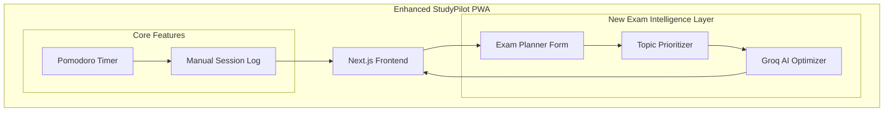

# PART H: EXAM CRISIS Mode & ADAPTIVE STUDY INTELLIGENCE
## Complete Feature Architecture for Last-Minute Learners

---

## 1. User Personas & Behavioral Patterns

### 1.1 Target User Segmentation
#### Persona A: "The Crammer" (60% of target users)
- **Behavior:** Studies 1-2 days before exam
- **Session length:** 4-8 hours straight
- **Pain points:** High anxiety, poor retention, all-nighters
- **Motivation:** Fear of failure, adrenaline-driven
- **StudyPilot Angle:** "Make every minute count"

---

## 2. Exam Intake & Planning

**Feature:** "Exam Blueprint" - Set up your exam timeline

**User Input Form:**
- Exam Name, Date, Weight
- Topics to cover (Confidence vs. Weight)
- Hours available to study

**AI-Generated Study Plan (via Groq API):**
```text
Based on 14 days until exam:
- Priority Topics: Derivatives (low confidence, 30% weight)
- Daily target: 5.2 hours
- Recommended mode: Accelerated
- Suggested schedule: 2 hours morning, 3 hours evening
```

---

## 3. Emergency Features for Crisis Mode (1-3 Days Before)

Because StudyPilot operates as a web browser app, we cannot lock the user out of their computer or block other applications. Instead, we rely on **Aggressive Psychological Nudging**.

### 3.1 Panic Button 🚨
**Location:** Persistent in top bar (red pulsing when <72 hours)

**Click Behavior:**
1. **Emergency Assessment:** Chapters left, Energy level, Hours since last sleep.
2. **AI Response:** 
   - Skip lowest weight chapters.
   - Focus strictly on high-yield.
   - Prescribe mandatory minimum sleep.

### 3.2 Web Sleep Guard (Anti-Burnout)
**Feature:** Aggressive nudging when dangerous patterns are detected based on the manual timer log.

**Triggers:**
- Timer runs > 12 hours in 24h → Screen flashes red, loud alarm plays. 
- AI Alert: *"You've studied 12 hours. Your brain is no longer retaining information. Close the laptop now."*
- Focus score < 30% (user keeps pausing timer) → Suggest 20-min power nap.

### 3.3 Exam Practice Mode (Timer-Strict)
**Feature:** A strict countdown environment.

**Behavior:**
- Full-screen web API takes over.
- Countdown timer visible.
- If the user switches tabs (detected via `document.visibilityState`), the app plays a loud warning beep to simulate a proctor watching them.

---

## 4. Modified System Architecture



---

## 5. Pricing Strategy: 100% Free For Students

*Per the core StudyPilot Promise, every feature in the Exam Crisis Mode suite is 100% free for students.*

| Feature | Student Tier |
|---------|-----------|
| Basic Timer | ✅ Free |
| Manual Logging | ✅ Free |
| Exam planning | ✅ Free |
| Topic prioritization | ✅ Free |
| Panic button | ✅ Free |
| Sleep guard nudges | ✅ Free |

**We do not monetize student anxiety.** There are no paywalls for "last-minute cramming tools."
