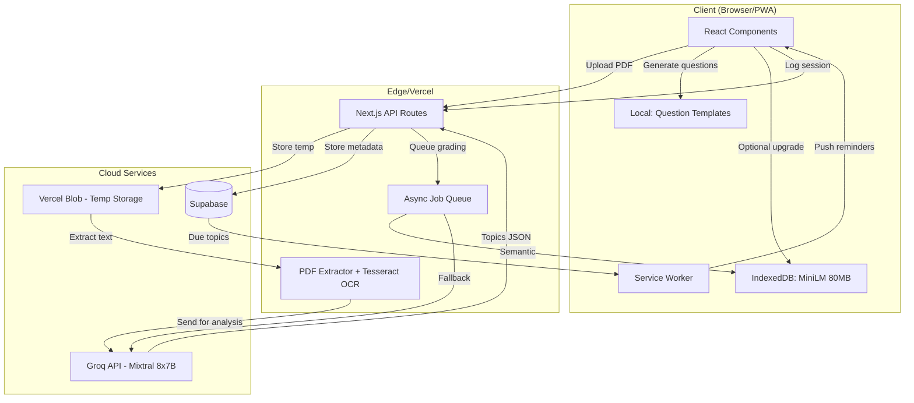

# PART J: TECHNICAL IMPLEMENTATION DETAILS

This section outlines the exact technical solutions to the most complex architectural challenges in StudyPilot V3.

## J.1 The PDF Text Extraction Pipeline (OCR Fallback)

Relying solely on `pdf-parse` will fail on older, scanned university exams. StudyPilot utilizes a layered extraction pipeline.

```typescript
// utils/pdf-extractor.ts
import pdfParse from 'pdf-parse';
import { createWorker } from 'tesseract.js';

async function extractPDFText(buffer: Buffer): Promise<string> {
  // Try text extraction first (fast, free)
  try {
    const data = await pdfParse(buffer);
    if (data.text.length > 500 && !hasGarbledText(data.text)) {
      return data.text;
    }
  } catch (e) {
    console.log('Text extraction failed, falling back to OCR');
  }
  
  // Fallback to OCR for scanned PDFs (runs locally)
  const worker = await createWorker('eng');
  const { data: { text } } = await worker.recognize(buffer);
  await worker.terminate();
  
  return text;
}

function hasGarbledText(text: string): boolean {
  const specialCharRatio = (text.match(/[^a-zA-Z0-9\s]/g) || []).length / text.length;
  return specialCharRatio > 0.3;
}
```

---

## J.2 The Groq Prompt Engineering (Core Extractor)

The prompt that parses the exam is the most critical code in the application. It must extract `keywords` so that offline local models can generate questions without needing the cloud.

```typescript
export const EXAM_ANALYSIS_PROMPT = `
You are analyzing a university exam paper. Extract topics that appear in questions.

Rules:
1. A "topic" is a specific concept (e.g., "Newton's Second Law", not "Physics")
2. Count how many questions reference each topic
3. Estimate exam weight percentage based on points per question
4. Return ONLY valid JSON, no explanation

Output format:
{
  "topics": [
    {
      "name": "string",
      "questionCount": number,
      "estimatedWeight": number (0-100),
      "keywords": ["string"] // 3-5 keywords for future offline retrieval/grading
    }
  ]
}

Exam text:
{{EXAM_TEXT}}
`;
```

---

## J.3 Spaced Repetition Algorithm (SM-2 Variant)

```typescript
interface ReviewResult {
  quality: 0 | 1 | 2 | 3 | 4 | 5; // 0=complete blackout, 5=perfect recall
}

interface FlashcardState {
  repetitions: number;    
  easeFactor: number;     // Multiplier for interval (starts at 2.5)
  interval: number;       // Days until next review
}

export function calculateNextReview(current: FlashcardState, result: ReviewResult): FlashcardState {
  let { repetitions, easeFactor, interval } = current;
  
  // Failed recall
  if (result.quality < 3) {
    return { repetitions: 0, easeFactor, interval: 1 };
  }
  
  // Successful recall
  if (repetitions === 0) interval = 1;
  else if (repetitions === 1) interval = 6;
  else interval = Math.round(interval * easeFactor);
  
  const newEaseFactor = easeFactor + (0.1 - (5 - result.quality) * (0.08 + (5 - result.quality) * 0.02));
  
  return {
    repetitions: repetitions + 1,
    easeFactor: Math.max(1.3, newEaseFactor),
    interval: Math.min(interval, 365)
  };
}
```

---

## J.4 Offline Model Loading Strategy (IndexedDB)

The 80MB `MiniLM` model must be downloaded seamlessly in the background.

```typescript
class ModelManager {
  private modelStatus: 'unloaded' | 'downloading' | 'ready' | 'failed' = 'unloaded';
  
  async ensureModel(): Promise<boolean> {
    const cached = await caches.open('studypilot-models');
    const response = await cached.match('/models/minilm.bin');
    if (response) {
      this.modelStatus = 'ready';
      return true;
    }
    this.downloadInBackground();
    return false; // Fallback to keyword templates while downloading
  }
  
  private async downloadInBackground() {
    this.modelStatus = 'downloading';
    // Show non-intrusive UI progress
    const response = await fetch('https://cdn.studypilot.com/models/minilm-v2.bin');
    const cache = await caches.open('studypilot-models');
    await cache.put('/models/minilm.bin', response);
    this.modelStatus = 'ready';
  }
}
```

---

## J.5 Web Push Notifications (VAPID + Cron)

```typescript
// app/api/push/subscribe/route.ts
import webpush from 'web-push';

webpush.setVapidDetails(
  'mailto:admin@studypilot.com',
  process.env.NEXT_PUBLIC_VAPID_PUBLIC_KEY!,
  process.env.VAPID_PRIVATE_KEY!
);

// Scheduled function (runs daily via Vercel Cron Jobs)
export async function sendDailyReminders() {
  const dueTopics = await db.exam_topics.findMany({
    where: { next_review_date: { lte: new Date() }, user: { push_enabled: true } }
  });
  
  for (const topic of dueTopics) {
    await webpush.sendNotification(
      topic.user.pushSubscription,
      JSON.stringify({
        title: 'Time to Review!',
        body: `Your spaced repetition for ${topic.topic_name} is due.`,
        icon: '/icon-192.png',
        data: { topicId: topic.id }
      })
    );
  }
}
```

---

## J.6 Complete Architecture Data Flow


