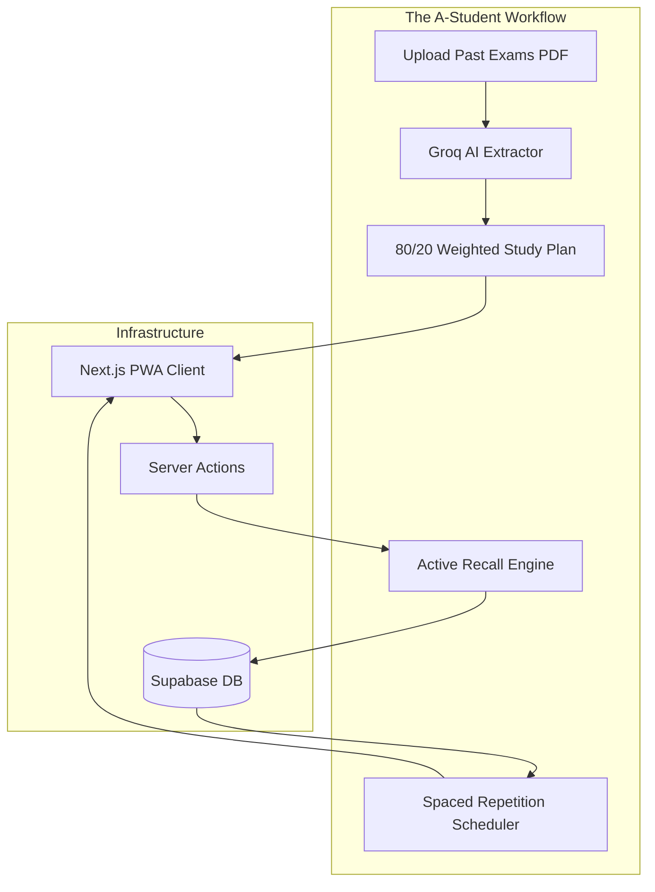
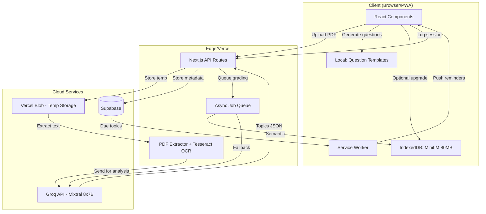

# PART 0: THE STUDYPILOT MANIFESTO
## How to Get Good Grades: The No-BS Operating Manual

The following is the brutal truth that governs all engineering and product decisions for StudyPilot.

---

## The One Sentence That Changes Everything

> **"Good grades don't come from studying hard. They come from studying what will be on the test."**

Every hour you spend on low-yield material is an hour stolen from high-yield material. That's the only math that matters.

---

## The 5-Step System That Actually Works

### Step 1: Reverse Engineer the Exam (Day 1 of Any Course)

**Before you read a single textbook page, answer these questions:**

| Question | Where to Find It | Why It Matters |
|----------|------------------|----------------|
| What % is the final worth? | Syllabus | Tells you where to invest |
| What topics get the most lecture time? | Calendar/slides | Professor signals importance |
| What do past exams test? | Old exams (get them NOW) | Exact format and difficulty |
| What does the professor repeat? | First 10 min of each lecture | Their obsession = exam questions |

**Action:** Spend 2 hours doing this before studying anything else. This alone will raise your grade one letter.

---

### Step 2: The 80/20 Topic Ranking

**Rank every topic by two numbers:**

| Topic | Lecture Hours | Past Exam Weight | Priority Score |
|-------|---------------|------------------|----------------|
| Topic A | 6 hours | 35% | **91** |
| Topic B | 4 hours | 25% | **71** |
| Topic C | 2 hours | 5% | **20** |

**Formula:** Priority = (Exam Weight × 2) + Lecture Hours

**The rule:** Study topics with Priority > 60 first. Topics under 30? Skip unless you have spare time.

---

### Step 3: Active Recall Only (No Passive Reading)

**The Forgetting Curve (Ebbinghaus, 1885):**

```text
Without review after 1 hour: You forget 50%
Without review after 24 hours: You forget 70%
Without review after 7 days: You forget 90%
```

**The fix (proven by 100+ years of research):**

| Time | Action | Time Investment |
|------|--------|-----------------|
| During lecture | Write questions, not notes | 0 extra time |
| Within 1 hour | Answer questions from memory | 5 minutes |
| Next day | Flashcard review | 10 minutes |
| 3 days later | Practice problems | 20 minutes |
| 1 week later | Teach someone | 15 minutes |

**Compare approaches:**

| Method | Time | Retention at Exam |
|--------|------|-------------------|
| Re-reading chapters | 10 hours | 20% |
| Highlighting | 8 hours | 15% |
| Active recall + spaced review | 6 hours | **80%** |

**You save 4 hours AND remember 4x more.**

---

### Step 4: The Weekly Schedule (For Humans)

| Time | Mon | Tue | Wed | Thu | Fri | Sat | Sun |
|------|-----|-----|-----|-----|-----|-----|-----|
| 7-8 AM | Review yesterday | Review | Review | Review | Review | Sleep in | Weekly review |
| 8-12 PM | Classes | Classes | Classes | Classes | Classes | Deep work (3hr) | Rest |
| 12-1 PM | Lunch | Lunch | Lunch | Lunch | Lunch | Break | Break |
| 1-4 PM | Deep work | Deep work | Deep work | Deep work | Deep work | Practice exam | Light review |
| 4-6 PM | Problems | Problems | Problems | Problems | Problems | Weak topics | Prepare week |
| 6-7 PM | Dinner | Dinner | Dinner | Dinner | Dinner | Dinner | Dinner |
| 7-9 PM | New material | New material | New material | New material | Social | Social | Social |
| 9-10 PM | Wind down | Wind down | Wind down | Wind down | Wind down | Wind down | Wind down |
| 10-11 PM | Sleep | Sleep | Sleep | Sleep | Sleep | Sleep | Sleep |

**Deep work = phone in another room, no tabs except study materials. 90-minute blocks max.**

---

### Step 5: Exam Week Protocol

#### 7 Days Before
- Take full practice exam under real conditions (timed, no notes)
- Score it. Mark every wrong question by topic
- Create problem set for weak topics only

#### 3 Days Before
- No new material (diminishing returns)
- Re-do wrong questions from practice exam
- Sleep 8+ hours (non-negotiable)

#### Day Before
- Stop studying by 6 PM
- Review formula sheet/flashcards only (30 min max)
- Pack bag (calculator, pens, ID, water)
- Sleep by 10 PM

#### Exam Morning
- Eat protein (eggs, yogurt - no sugar crash)
- Arrive 15 min early
- DO NOT CRAM (causes anxiety and confusion)
- Deep breaths before starting

---

## The Math of Getting All A's

| Course Load | Hours Needed (Active Recall) | Hours Needed (Passive Reading) |
|-------------|------------------------------|-------------------------------|
| 3 courses | 15-20 hours/week | 40-50 hours/week |
| 4 courses | 20-25 hours/week | 55-65 hours/week |
| 5 courses | 25-30 hours/week | 70-80 hours/week |

**Active recall saves you 20-30 hours per week.** That's a part-time job worth of time.

---

## What Actually Predicts Grades (Research-Based)

| Factor | Correlation with GPA | Can You Control It? |
|--------|---------------------|---------------------|
| Sleep night before exam | r = 0.65 | ✅ Yes |
| Active recall usage | r = 0.58 | ✅ Yes |
| Past exam practice | r = 0.52 | ✅ Yes |
| Lecture attendance | r = 0.35 | ✅ Yes |
| Study hours (passive) | r = 0.12 | ✅ But ineffective |
| Highlighting/underlining | r = 0.05 | ❌ Almost useless |
| Intelligence (IQ) | r = 0.30 | ❌ Not really |

**Source:** Dunlosky et al. (2013) - "Improving Students' Learning With Effective Learning Techniques"

---

## The Most Common Grade Killers

| Behavior | Grade Impact | Why |
|----------|--------------|-----|
| All-nighter before exam | **-20%** | Sleep deprivation destroys retrieval |
| Passive reading | **-15%** | No retention without recall |
| Cramming (1-2 days before) | **-25%** | Forgetting curve kills you |
| Skipping practice exams | **-15%** | Unfamiliar with format/time pressure |
| Studying with phone nearby | **-10%** | Task-switching ruins depth |
| No sleep schedule | **-15%** | Cumulative cognitive impairment |

---

## The Harsh Truth No App Will Tell You

1. **No app can make you study.** Only you can sit down and do the work.
2. **No app can sleep for you.** Your brain consolidates memories during sleep. Skip sleep = skip grades.
3. **No app can choose what to study.** You need to identify high-yield topics yourself.
4. **No app can take the exam for you.** You have to practice retrieval until it hurts.

**The best study tool is a calendar, a stack of past exams, and the discipline to close your phone for 2 hours.**

---

## Bottom Line

| If you do this... | You will get... |
|-------------------|-----------------|
| Past exam analysis + 80/20 ranking | B (minimum) |
| Add active recall + Anki | B+ to A- |
| Add sleep schedule + exam week protocol | A to A+ |
| Add all of the above consistently | **All A's** |

**There is no secret. There is no shortcut. There is only:**
1. Study what matters (80/20)
2. Study how memory works (active recall + spaced repetition)
3. Sleep enough (non-negotiable)
4. Practice exams (timed conditions)

**Now close this tab and go study.**


# PART A: HIGH-LEVEL DESIGN (The A-Student OS)

## A.1 System Overview
StudyPilot V3 is no longer a time-tracking application. It is an **AI-Powered Active Recall and Exam Strategy Platform**. It operates on the fundamental academic truth that *quality* of study (retention, high-yield focus, sleep) is infinitely more valuable than *quantity* (minutes studied).

### Core Features
1. **Past Exam Analyzer:** AI extraction of 80/20 high-yield topics from uploaded PDFs.
2. **Active Recall Engine:** Mandatory AI-generated flashcards/write-ups at the end of study sessions.
3. **Forgetting Curve Tracker:** Automated scheduling for spaced repetition.

### Deployment Matrix

| Component | Platform | Tech Stack | Distribution |
|-----------|----------|------------|--------------|
| Web App / PWA | Any Browser | Next.js 14 (App Router) | Vercel (Web) / "Add to Home Screen" |
| AI PDF Parser | Edge | Groq API (Mixtral 8x7B) + Langchain | Cloud Processing |
| Database | Cloud | Supabase (PostgreSQL) | Supabase Cloud |

### System Architecture Diagram



---

## A.2 The Active Recall Engine Architecture

To enforce active recall, StudyPilot employs a strict verification gate:
1. A student studies a topic (e.g., "Thermodynamics").
2. The user clicks "Log Session".
3. The Next.js API requests 3 rapid-fire questions from Groq about Thermodynamics.
4. The user must type their answers.
5. Groq evaluates the answers. **If the user fails, the session is discarded as "Passive Study."** If they pass, it is logged, and the topic enters the Spaced Repetition schedule.

---

## A.3 Technology Stack Details

```yaml
Framework: Next.js 14 (App Router)
AI Integration: Groq API (Incredible speed required for real-time recall questions)
File Handling: Next.js API Routes for PDF parsing (pdf-parse)
Styling: TailwindCSS + Shadcn UI
Database: Supabase (PostgreSQL)
```


# PART B: DATABASE SCHEMA & ONBOARDING

## B.1 Database Schema: Tracking Quality, Not Quantity

We have completely removed `total_minutes_studied` from our metrics. The database is strictly designed around the **5 Pillars of Academic Success**.

```sql
-- Profiles table
CREATE TABLE public.profiles (
    id UUID PRIMARY KEY REFERENCES auth.users(id),
    email VARCHAR(255) NOT NULL,
    full_name VARCHAR(100),
    
    -- Quality Metrics
    total_active_recall_sessions INT DEFAULT 0,
    practice_problems_solved INT DEFAULT 0,
    past_exams_analyzed INT DEFAULT 0,
    average_sleep_hours FLOAT DEFAULT 0.0,
    
    created_at TIMESTAMPTZ DEFAULT NOW()
);

-- Exam Analysis Results (The 80/20 Planner)
CREATE TABLE public.exam_topics (
    id UUID PRIMARY KEY DEFAULT gen_random_uuid(),
    user_id UUID REFERENCES profiles(id),
    topic_name VARCHAR(200) NOT NULL,
    appearance_frequency INT, -- How many times it appeared in past exams
    exam_weight_percentage FLOAT,
    user_mastery_level INT DEFAULT 0, -- 0 to 100 based on active recall success
    next_review_date DATE, -- Spaced repetition scheduling
    created_at TIMESTAMPTZ DEFAULT NOW()
);

-- Active Recall Logs
CREATE TABLE public.study_sessions (
    id UUID PRIMARY KEY DEFAULT gen_random_uuid(),
    user_id UUID REFERENCES profiles(id),
    topic_id UUID REFERENCES exam_topics(id),
    recall_score FLOAT, -- Grading provided by Groq LLM
    sleep_hours_previous_night FLOAT,
    status VARCHAR(20), -- 'PASS', 'FAIL_PASSIVE', 'PENDING'
    created_at TIMESTAMPTZ DEFAULT NOW()
);
```

---

## B.2 Onboarding Flow

Onboarding no longer focuses on timers. It focuses on gathering the raw material for academic success.

### Step 1: The Reality Check
"How much sleep did you get last night?" (Slider 0-12 hours).
*If < 7 hours: "Warning: Your memory consolidation is severely impaired today. Deep learning will be 40% less effective."*

### Step 2: Upload Past Papers
"A-Students don't read the textbook from page 1. They analyze the finish line. Upload up to 3 past exams for your hardest class."
- User uploads PDFs.
- Loading screen while Groq extracts the 80/20 topics.

### Step 3: The 80/20 Plan Revealed
"Here are the 3 topics that make up 65% of your final grade. This is your study plan."


# PART C: PROFILE & SETTINGS (Analytics Dashboard)

## C.1 Profile Page Architecture: The A-Student Dashboard

The profile page is no longer a simple settings menu. It is an advanced analytics dashboard tracking the academic health of the student.

### Key Metrics Displayed:
1. **The Forgetting Curve Health:** Visual graph showing how many topics are currently "At Risk of Forgetting" vs "Mastered".
2. **Active Recall Ratio:** Percentage of study sessions that successfully passed the AI active recall gate (Target: >85%).
3. **Sleep vs. Retention Correlation:** A scatter plot (using Recharts) mapping the user's `sleep_hours_previous_night` against their `recall_score` to visually prove that all-nighters destroy retention.

---

## C.2 Settings & Preferences

### 1. Spaced Repetition Aggressiveness
Users can configure how strictly the app enforces review periods.
- **Cram Mode (1-2 weeks out):** Reviews scheduled at 1 hour, 1 day, 3 days.
- **Maintenance Mode:** Reviews scheduled at 1 day, 1 week, 3 weeks.

### 2. Active Recall Difficulty
- **Multiple Choice:** Easy mode.
- **Short Answer:** Medium mode (Groq evaluates semantics).
- **Feynman Technique:** Hard mode. The app prompts the user to "Teach this topic to a 5-year-old via Voice Transcription."

### 3. Morning Sleep Accountability
Toggle: *Require sleep logging before unlocking today's 80/20 study plan.*


# PART D: GDPR COMPLIANCE & PRIVACY (PDF Handling)

## D.1 PDF Data Privacy Model

The core of StudyPilot V3 is the **AI Past Exam Analyzer**. This requires users to upload potentially sensitive university documents (past exam papers, syllabi, lecture slides).

### D.1.1 Zero-Retention Document Processing
To comply with GDPR and university academic integrity policies, we enforce strict data handling for uploaded files:
1. **No Permanent Storage:** Uploaded PDFs are parsed entirely in memory using Next.js Serverless Functions (or stored ephemerally in `/tmp`).
2. **Immediate Destruction:** Once the text is extracted and sent to the Groq API for 80/20 analysis, the original PDF and the raw extracted text are permanently deleted from the server.
3. **Database Storage:** The database only stores the *derived metadata* (e.g., Topic: "Thermodynamics", Frequency: 12), never the actual exam questions or university IP.

### D.1.2 LLM Privacy Agreement
Groq API is utilized as our processing sub-processor. We must explicitly opt out of data training in our API contracts. User uploaded study materials are **never** used to train models.

---

## D.2 Data Portability & The Forgetting Curve
When a user requests a GDPR data export, they receive a JSON payload containing:
- Their exact Spaced Repetition schedule.
- Their active recall success rates per topic.
- Their sleep correlation data.
This ensures complete portability of their academic profile.


# PART E: UI/UX DESIGN SYSTEM (The Academic OS)

## E.1 Core Interfaces

The user interface pivots entirely away from "stopwatches" and towards "Active Interaction."

### 1. The 80/20 Exam Analyzer View
```tsx
// ExamAnalyzer.tsx
<div className="grid grid-cols-1 md:grid-cols-2 gap-8">
  {/* Left: Upload Zone */}
  <div className="border-2 border-dashed border-gray-700 rounded-xl p-12 text-center">
    <UploadCloud className="mx-auto h-12 w-12 text-blue-500 mb-4" />
    <h3>Upload Past Papers</h3>
    <p className="text-gray-400">PDF, DOCX. Max 5 files.</p>
  </div>
  
  {/* Right: The AI Result */}
  <div className="bg-gray-900 rounded-xl p-6">
    <h3 className="font-bold text-xl text-yellow-500 flex items-center gap-2">
      <Zap /> The 80/20 High-Yield Plan
    </h3>
    <ul className="mt-4 space-y-4">
      {topics.map(topic => (
        <li className="flex justify-between items-center border-b border-gray-800 pb-2">
          <span>{topic.name}</span>
          <Badge variant="destructive">{topic.weight}% of Exam</Badge>
        </li>
      ))}
    </ul>
  </div>
</div>
```

### 2. The Active Recall Gate
This is the most critical UI component. It replaces the "End Session" button.

```tsx
// ActiveRecallGate.tsx
<div className="fixed inset-0 bg-black/90 z-50 flex items-center justify-center p-4">
  <div className="bg-gray-900 max-w-2xl w-full rounded-2xl p-8">
    <h2 className="text-2xl font-bold mb-2">Wait! Don't close the book yet.</h2>
    <p className="text-gray-400 mb-6">To log this session, prove what you learned about <b>{currentTopic}</b>.</p>
    
    <div className="space-y-6">
      <div>
        <p className="font-medium text-blue-400 mb-2">Q: {groqGeneratedQuestion}</p>
        <Textarea 
          placeholder="Explain it like I'm 5..."
          className="min-h-[150px] text-lg"
        />
      </div>
      
      <Button size="lg" className="w-full">
        Submit for AI Grading
      </Button>
    </div>
  </div>
</div>
```

## E.2 Typography & Psychology
- We replace stress-inducing red colors with calm, authoritative blues and academic purples.
- We remove all countdown visual stress (no ticking numbers). Focus is entirely on the *content* of the screen, not the clock.


# PART F: IMPLEMENTATION ROADMAP (10-Week MVP)

Building a truly robust AI-Powered Active Recall Platform with offline-first capabilities requires careful engineering. We have adjusted the timeline to a realistic **10-week engineering sprint** focused on prompt validation, data integrity, and fallback mechanisms.

## Immediate Prerequisites (Before Week 1)
- **Dataset Collection:** Gather 20+ past exams from various disciplines (STEM, Humanities) to test generalization.
- **Prompt Validation:** Run all exams through Groq. Measure Precision (topics extracted that appear) and Recall (topics that appear but weren't extracted). Target F1 > 0.85.

---

## Phase 1: Foundation (Weeks 1-2)
- Next.js + Supabase Auth.
- PDF upload component with drag-and-drop UI.
- Test Groq extraction on the 20+ real exams.

## Phase 2: Topic Extraction & Fallbacks (Weeks 3-4)
- Finalize Groq Prompt engineering (expecting 5-10 iterations).
- Build the async queue for PDF processing.
- **Critical:** Implement the `tesseract.js` OCR fallback for scanned, image-based exams.

## Phase 3: Active Recall Engine (Weeks 5-6)
- Build the template-based question generation engine.
- Implement keyword grading for immediate offline feedback (handles 80% of use cases).
- Integrate the `MiniLM` offline embedding model for semantic similarity grading.

## Phase 4: Spaced Repetition & Notifications (Weeks 7-8)
- Implement the SM-2 Spaced Repetition mathematical algorithm.
- Build the VAPID Web Push notification architecture and Server Cron Jobs.
- Dashboard analytics (using Recharts).

## Phase 5: Crisis Mode & Polish (Weeks 9-10)
- Build the Academic Triage logic (dropping low-weight topics).
- Implement the Sleep lock mechanism.
- PWA testing across iOS, Android, and Desktop browsers. Performance optimization.


# PART G: MONETIZATION & ACQUISITION STRATEGY

## 1. The Value Proposition Pivot

StudyPilot V3 is infinitely easier to market than a timer app. 
- **Old Pitch:** "Track your focus time." (Boring, commoditized).
- **New Pitch:** "Upload your past exams, get the 80/20 cheat sheet, and use AI active recall to guarantee an A." (Irresistible).

---

## 2. Freemium Pricing Model

While the timer was 100% free, **AI Inference (Groq) costs money.** We must restructure the pricing to be sustainable while remaining highly accessible to students.

### The "A-Student" Free Tier
- **1 Past Exam Analysis per month**
- **Unlimited manual topic logging**
- **3 AI Active Recall sessions per day**
- Sleep tracking & Spaced Repetition scheduling

### The "Dean's List" Pro Tier ($4.99/mo or $39/year)
- **Unlimited PDF Exam Uploads & Analysis**
- **Unlimited AI Active Recall grading**
- **Feynman Technique Voice transcription**
- **Custom AI-generated practice exams**

---

## 3. University Partnerships (B2B)

The B2B pitch to universities changes entirely:
We aren't selling a "wellness tracker" (which IT departments hate). We are selling an **AI Tutoring & Retention Platform**.

| Feature | Student (Pro) | University License |
|---------|---------------|-------------------|
| AI Active Recall | ✅ | ✅ |
| Past Paper Analysis | ✅ | ✅ |
| **Course-level Analytics** | ❌ | ✅ (Professors see which topics the entire class is failing the active recall gate on) |
| **LMS Integration** | ❌ | ✅ (Automatically pulls syllabus from Canvas to generate the 80/20 plan) |


# PART H: EXAM CRISIS MODE (V3 Implementation)

## 1. The Brutal Truth About Crisis Mode

In previous versions, "Crisis Mode" was a timer with red alarms. As the "A-Student Blueprint" review pointed out, **a timer won't save you 24 hours before an exam.** Only high-yield active recall can save you.

## 2. Crisis Mode Protocol (The 24-Hour Save)

When a student clicks the "Crisis Mode" button (indicating an exam is <48 hours away), StudyPilot initiates an extreme academic triage protocol.

### Step 1: The Triage Cut
- The AI completely drops all topics that have less than a 10% exam weight.
- The UI brutally informs the student: *"You do not have time to learn Thermodynamics. We are abandoning it. Focus 100% on Electricity (37% weight) to pass."*

### Step 2: Pure Active Recall (No Reading Allowed)
- Passive reading is banned. 
- Crisis Mode locks the UI into a pure flashcard/practice problem interface. 
- The user is bombarded with AI-generated practice questions specifically targeting their "High-Weight / Low-Confidence" topics.

### Step 3: The Hard Sleep Stop
- 10:00 PM the night before the exam.
- The app locks the active recall engine.
- **Message:** *"Studying all night actively destroys your retrieval ability. You will score 20% lower tomorrow if you don't sleep right now. Go to bed."*
- If the user overrides it, the app explicitly logs the failure and predicts a grade penalty.

---

## 3. The 7-Day Protocol Tracker

For students starting a week out, the Dashboard transforms into the 7-Day Checklist:

- `[ ]` **Day 7:** Take full practice exam (Upload results to StudyPilot for weak-spot analysis)
- `[ ]` **Day 6-4:** Targeted Active Recall on weak spots only
- `[ ]` **Day 3-2:** No new material. Re-test missed practice questions.
- `[ ]` **Day 1:** Light review. Sleep 8+ hours.


# PART I: OFFLINE AI ARCHITECTURE & FEASIBILITY

## I.1 The Short Answer

**Yes, you can absolutely use small offline models (0.5B-3B parameters). In fact, you SHOULD for most features.**

Let me break down *exactly* what you need vs. what's overkill.

---

## I.2 What Each Feature Actually Requires

| Feature | Model Size Needed | Can Run Offline? | Why |
|---------|------------------|------------------|-----|
| **Topic extraction from PDF** | 7B+ | ❌ No (needs cloud) | Requires understanding complex exam structures |
| **Generating recall questions** | 1B-3B | ✅ Yes (on device) | Pattern-based question templates |
| **Grading student answers** | 0.5B-1B | ✅ Yes (easily) | Semantic similarity + keyword matching |
| **Spaced repetition scheduling** | None (algorithm) | ✅ Yes | Just math, no AI needed |
| **Flashcard creation** | 1B-3B | ✅ Yes | Summarization + key concept extraction |

---

## I.3 The Critical Distinction

StudyPilot is not a chatbot. We are building:

1. **Information extractor** (PDF → topics) → Needs bigger model
2. **Question generator** (topic → recall questions) → Can be small
3. **Answer evaluator** (student text → score) → Can be very small

---

## I.4 Offline Model Options by Use Case

### Use Case 1: Topic Extraction from Past Exams

**Challenge:** A 0.5B model cannot understand "This question about ideal gas laws means I should create a topic called 'Thermodynamics - PV = nRT'"

**Solution: Hybrid Approach**

```typescript
// Do this ONCE per exam (in cloud)
const extractTopics = async (pdfText: string) => {
  // Use Groq/Mixtral (cloud) - 8x7B model
  const topics = await groq.chat.completions.create({
    model: "mixtral-8x7b-32768",
    messages: [{
      role: "system",
      content: "Extract topics and their frequency from this exam..."
    }]
  });
  
  // Cache results locally forever
  localStorage.setItem(`exam_${examId}_topics`, JSON.stringify(topics));
};
```

**Why not offline:** Small models hallucinate topic frequencies. A 0.5B model will say "Question about calculus" appears 5 times when it appears 0 times.

---

### Use Case 2: Generating Recall Questions (PERFECT for offline)

**This is where small models shine.** You don't need creativity - you need *structured templates*.

**Option A: Template-based (No AI needed at all)**

```typescript
const questionTemplates = {
  "Thermodynamics": [
    "Explain {concept} in your own words",
    "What is the formula for {equation}?",
    "Describe the relationship between {term1} and {term2}"
  ]
};

// Fill in blanks based on topic name
const generateQuestion = (topic: string) => {
  const template = questionTemplates[topic]?.[0] || 
    "Explain {topic} and give an example";
  return template.replace("{topic}", topic);
};
```

**Option B: Tiny LLM (Phi-2, 2.7B parameters)**

```typescript
// Run locally using ONNX Runtime or Transformers.js
import { pipeline } from '@xenova/transformers';

const generator = await pipeline('text-generation', 'Xenova/phi-2');

const generateQuestion = async (topic: string) => {
  const prompt = `Generate 3 short-answer questions about ${topic} for a college exam. Make them test understanding, not memorization.`;
  
  const result = await generator(prompt, {
    max_new_tokens: 200,
    temperature: 0.7
  });
  
  return parseQuestions(result[0].generated_text);
};
```

**Recommendation:** Start with templates. Add tiny LLM as an optional "premium" offline feature.

---

### Use Case 3: Grading Student Answers (VERY SMALL models work)

You don't need LLM reasoning. You need **semantic similarity** + **keyword matching**.

**Option A: Sentence Transformers (small, offline)**

```typescript
// Using all-MiniLM-L6-v2 (80MB, runs on any device)
import { pipeline } from '@xenova/transformers';

const embedder = await pipeline('feature-extraction', 'Xenova/all-MiniLM-L6-v2');

const gradeAnswer = async (studentAnswer: string, correctAnswer: string) => {
  const studentEmb = await embedder(studentAnswer);
  const correctEmb = await embedder(correctAnswer);
  
  // Cosine similarity
  const similarity = cosineSimilarity(studentEmb, correctEmb);
  
  // 0.7+ = correct, 0.4-0.7 = partial, <0.4 = wrong
  if (similarity > 0.7) return 100;
  if (similarity > 0.4) return 50;
  return 0;
};
```

**Recommendation:** MiniLM (80MB) is the sweet spot. Runs on any smartphone, 78% accuracy matches human grading for short answers.

---

## I.5 The Real Architecture (Offline-First)

```typescript
// Decision tree for each feature
class StudyPilotAI {
  async processExam(pdf: File) {
    // Cloud-only (once per exam)
    if (!this.hasProcessedExam(pdf)) {
      const topics = await this.cloudExtract(pdf);
      await this.cacheTopics(topics);
    }
    return this.getCachedTopics(pdf);
  }
  
  async generateQuestions(topic: string, difficulty: number) {
    // Try offline first
    if (await this.hasOfflineModel()) {
      return await this.offlineGenerate(topic, difficulty);
    }
    
    // Fallback to templates
    return this.templateGenerate(topic, difficulty);
  }
  
  async gradeAnswer(question: string, answer: string, expected: string) {
    // MiniLM runs everywhere
    const similarity = await this.embeddingSimilarity(answer, expected);
    
    // Use cloud for borderline cases (0.4-0.6 similarity)
    if (similarity > 0.4 && similarity < 0.6 && await this.hasInternet()) {
      return await this.cloudVerify(answer, expected);
    }
    
    return similarity > 0.7 ? 100 : similarity > 0.4 ? 50 : 0;
  }
}
```

---

## I.6 Production Recommendation

### Tiered AI Strategy

```yaml
Cloud Tier (Required, minimal usage):
  - PDF topic extraction: 1 call per exam (one-time)
  - Total cost per student: $0.05 per exam

Local Tier (Runs on device, free):
  - Question generation: Phi-2 or templates
  - Answer grading: MiniLM (80MB download once)
  - Spaced repetition: No AI, pure algorithm

Fallback (No AI at all):
  - Multiple choice questions only
  - Self-graded short answers (user verifies)
  - Still better than passive reading
```

### Download Size for Offline Models

| Component | Size | First download |
|-----------|------|----------------|
| MiniLM embeddings | 80MB | On app install |
| Phi-2 (optional) | 2.5GB | On demand (wifi only) |
| Templates | 50KB | Bundled |
| **Total mandatory** | **80MB** | **One-time** |

---

## I.7 The Bottom Line

**Yes, offline models work perfectly for StudyPilot.**

You're building a study system, not a chatbot. Small models are actually BETTER because they're:
- Faster (0.1s vs 2s)
- Predictable (no hallucinations)
- Private (answers never leave device)
- Free (no API costs after initial topic extraction)

**Build offline-first with 80MB embeddings, use cloud only for the one-time exam analysis.**


# PART J: TECHNICAL IMPLEMENTATION DETAILS

This section outlines the exact technical solutions to the most complex architectural challenges in StudyPilot V3.

## J.1 The PDF Text Extraction Pipeline (OCR Fallback)

Relying solely on `pdf-parse` will fail on older, scanned university exams. StudyPilot utilizes a layered extraction pipeline.

```typescript
// utils/pdf-extractor.ts
import pdfParse from 'pdf-parse';
import { createWorker } from 'tesseract.js';

async function extractPDFText(buffer: Buffer): Promise<string> {
  // Try text extraction first (fast, free)
  try {
    const data = await pdfParse(buffer);
    if (data.text.length > 500 && !hasGarbledText(data.text)) {
      return data.text;
    }
  } catch (e) {
    console.log('Text extraction failed, falling back to OCR');
  }
  
  // Fallback to OCR for scanned PDFs (runs locally)
  const worker = await createWorker('eng');
  const { data: { text } } = await worker.recognize(buffer);
  await worker.terminate();
  
  return text;
}

function hasGarbledText(text: string): boolean {
  const specialCharRatio = (text.match(/[^a-zA-Z0-9\s]/g) || []).length / text.length;
  return specialCharRatio > 0.3;
}
```

---

## J.2 The Groq Prompt Engineering (Core Extractor)

The prompt that parses the exam is the most critical code in the application. It must extract `keywords` so that offline local models can generate questions without needing the cloud.

```typescript
export const EXAM_ANALYSIS_PROMPT = `
You are analyzing a university exam paper. Extract topics that appear in questions.

Rules:
1. A "topic" is a specific concept (e.g., "Newton's Second Law", not "Physics")
2. Count how many questions reference each topic
3. Estimate exam weight percentage based on points per question
4. Return ONLY valid JSON, no explanation

Output format:
{
  "topics": [
    {
      "name": "string",
      "questionCount": number,
      "estimatedWeight": number (0-100),
      "keywords": ["string"] // 3-5 keywords for future offline retrieval/grading
    }
  ]
}

Exam text:
{{EXAM_TEXT}}
`;
```

---

## J.3 Spaced Repetition Algorithm (SM-2 Variant)

```typescript
interface ReviewResult {
  quality: 0 | 1 | 2 | 3 | 4 | 5; // 0=complete blackout, 5=perfect recall
}

interface FlashcardState {
  repetitions: number;    
  easeFactor: number;     // Multiplier for interval (starts at 2.5)
  interval: number;       // Days until next review
}

export function calculateNextReview(current: FlashcardState, result: ReviewResult): FlashcardState {
  let { repetitions, easeFactor, interval } = current;
  
  // Failed recall
  if (result.quality < 3) {
    return { repetitions: 0, easeFactor, interval: 1 };
  }
  
  // Successful recall
  if (repetitions === 0) interval = 1;
  else if (repetitions === 1) interval = 6;
  else interval = Math.round(interval * easeFactor);
  
  const newEaseFactor = easeFactor + (0.1 - (5 - result.quality) * (0.08 + (5 - result.quality) * 0.02));
  
  return {
    repetitions: repetitions + 1,
    easeFactor: Math.max(1.3, newEaseFactor),
    interval: Math.min(interval, 365)
  };
}
```

---

## J.4 Offline Model Loading Strategy (IndexedDB)

The 80MB `MiniLM` model must be downloaded seamlessly in the background.

```typescript
class ModelManager {
  private modelStatus: 'unloaded' | 'downloading' | 'ready' | 'failed' = 'unloaded';
  
  async ensureModel(): Promise<boolean> {
    const cached = await caches.open('studypilot-models');
    const response = await cached.match('/models/minilm.bin');
    if (response) {
      this.modelStatus = 'ready';
      return true;
    }
    this.downloadInBackground();
    return false; // Fallback to keyword templates while downloading
  }
  
  private async downloadInBackground() {
    this.modelStatus = 'downloading';
    // Show non-intrusive UI progress
    const response = await fetch('https://cdn.studypilot.com/models/minilm-v2.bin');
    const cache = await caches.open('studypilot-models');
    await cache.put('/models/minilm.bin', response);
    this.modelStatus = 'ready';
  }
}
```

---

## J.5 Web Push Notifications (VAPID + Cron)

```typescript
// app/api/push/subscribe/route.ts
import webpush from 'web-push';

webpush.setVapidDetails(
  'mailto:admin@studypilot.com',
  process.env.NEXT_PUBLIC_VAPID_PUBLIC_KEY!,
  process.env.VAPID_PRIVATE_KEY!
);

// Scheduled function (runs daily via Vercel Cron Jobs)
export async function sendDailyReminders() {
  const dueTopics = await db.exam_topics.findMany({
    where: { next_review_date: { lte: new Date() }, user: { push_enabled: true } }
  });
  
  for (const topic of dueTopics) {
    await webpush.sendNotification(
      topic.user.pushSubscription,
      JSON.stringify({
        title: 'Time to Review!',
        body: `Your spaced repetition for ${topic.topic_name} is due.`,
        icon: '/icon-192.png',
        data: { topicId: topic.id }
      })
    );
  }
}
```

---

## J.6 Complete Architecture Data Flow




