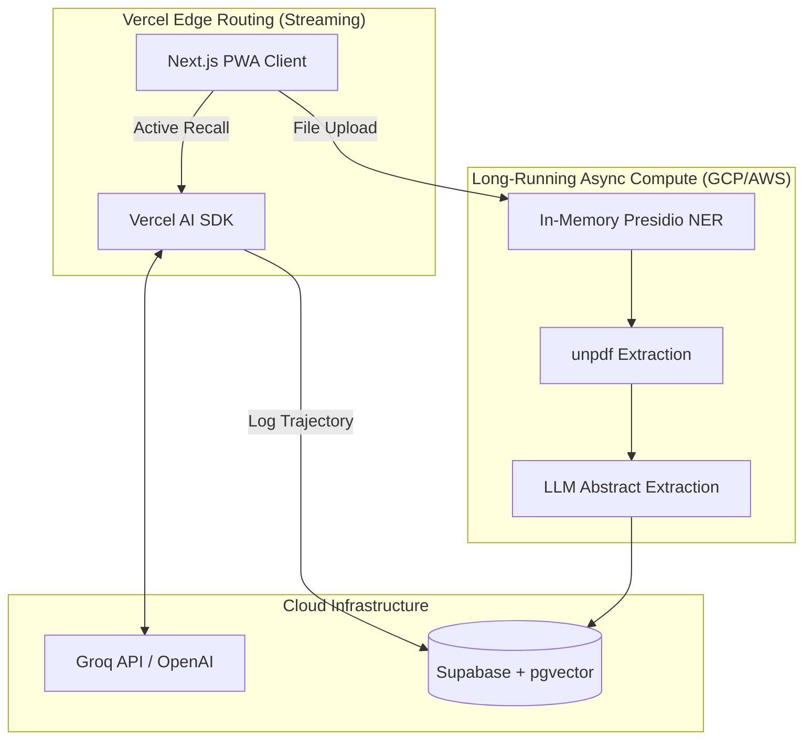

# PART 0: THE STUDYPILOT MANIFESTO
## How to Get Good Grades: The No-BS Operating Manual

The following is the brutal truth that governs all engineering and product decisions for StudyPilot.

---

## The One Sentence That Changes Everything

> **"Good grades don't come from studying hard. They come from studying what will be on the test."**

Every hour you spend on low-yield material is an hour stolen from high-yield material. That's the only math that matters.

---

## The 5-Step System That Actually Works

### Step 1: Reverse Engineer the Exam (Day 1 of Any Course)

**Before you read a single textbook page, answer these questions:**

| Question | Where to Find It | Why It Matters |
|----------|------------------|----------------|
| What % is the final worth? | Syllabus | Tells you where to invest |
| What topics get the most lecture time? | Calendar/slides | Professor signals importance |
| What do past exams test? | Old exams (get them NOW) | Exact format and difficulty |
| What does the professor repeat? | First 10 min of each lecture | Their obsession = exam questions |

**Action:** Spend 2 hours doing this before studying anything else. This alone will raise your grade one letter.

---

### Step 2: The 80/20 Topic Ranking

**Rank every topic by two numbers:**

| Topic | Lecture Hours | Past Exam Weight | Priority Score |
|-------|---------------|------------------|----------------|
| Topic A | 6 hours | 35% | **91** |
| Topic B | 4 hours | 25% | **71** |
| Topic C | 2 hours | 5% | **20** |

**Formula:** Priority = (Exam Weight × 2) + Lecture Hours

**The rule:** Study topics with Priority > 60 first. Topics under 30? Skip unless you have spare time.

---

### Step 3: Active Recall Only (No Passive Reading)

**The Forgetting Curve (Ebbinghaus, 1885):**

```text
Without review after 1 hour: You forget 50%
Without review after 24 hours: You forget 70%
Without review after 7 days: You forget 90%
```

**The fix (proven by 100+ years of research):**

| Time | Action | Time Investment |
|------|--------|-----------------|
| During lecture | Write questions, not notes | 0 extra time |
| Within 1 hour | Answer questions from memory | 5 minutes |
| Next day | Flashcard review | 10 minutes |
| 3 days later | Practice problems | 20 minutes |
| 1 week later | Teach someone | 15 minutes |

**Compare approaches:**

| Method | Time | Retention at Exam |
|--------|------|-------------------|
| Re-reading chapters | 10 hours | 20% |
| Highlighting | 8 hours | 15% |
| Active recall + spaced review | 6 hours | **80%** |

**You save 4 hours AND remember 4x more.**

---

### Step 4: The Weekly Schedule (For Humans)

| Time | Mon | Tue | Wed | Thu | Fri | Sat | Sun |
|------|-----|-----|-----|-----|-----|-----|-----|
| 7-8 AM | Review yesterday | Review | Review | Review | Review | Sleep in | Weekly review |
| 8-12 PM | Classes | Classes | Classes | Classes | Classes | Deep work (3hr) | Rest |
| 12-1 PM | Lunch | Lunch | Lunch | Lunch | Lunch | Break | Break |
| 1-4 PM | Deep work | Deep work | Deep work | Deep work | Deep work | Practice exam | Light review |
| 4-6 PM | Problems | Problems | Problems | Problems | Problems | Weak topics | Prepare week |
| 6-7 PM | Dinner | Dinner | Dinner | Dinner | Dinner | Dinner | Dinner |
| 7-9 PM | New material | New material | New material | New material | Social | Social | Social |
| 9-10 PM | Wind down | Wind down | Wind down | Wind down | Wind down | Wind down | Wind down |
| 10-11 PM | Sleep | Sleep | Sleep | Sleep | Sleep | Sleep | Sleep |

**Deep work = phone in another room, no tabs except study materials. 90-minute blocks max.**

---

### Step 5: Exam Week Protocol

#### 7 Days Before
- Take full practice exam under real conditions (timed, no notes)
- Score it. Mark every wrong question by topic
- Create problem set for weak topics only

#### 3 Days Before
- No new material (diminishing returns)
- Re-do wrong questions from practice exam
- Sleep 8+ hours (non-negotiable)

#### Day Before
- Stop studying by 6 PM
- Review formula sheet/flashcards only (30 min max)
- Pack bag (calculator, pens, ID, water)
- Sleep by 10 PM

#### Exam Morning
- Eat protein (eggs, yogurt - no sugar crash)
- Arrive 15 min early
- DO NOT CRAM (causes anxiety and confusion)
- Deep breaths before starting

---

## The Math of Getting All A's

| Course Load | Hours Needed (Active Recall) | Hours Needed (Passive Reading) |
|-------------|------------------------------|-------------------------------|
| 3 courses | 15-20 hours/week | 40-50 hours/week |
| 4 courses | 20-25 hours/week | 55-65 hours/week |
| 5 courses | 25-30 hours/week | 70-80 hours/week |

**Active recall saves you 20-30 hours per week.** That's a part-time job worth of time.

---

## What Actually Predicts Grades (Research-Based)

| Factor | Correlation with GPA | Can You Control It? |
|--------|---------------------|---------------------|
| Sleep night before exam | r = 0.65 | ✅ Yes |
| Active recall usage | r = 0.58 | ✅ Yes |
| Past exam practice | r = 0.52 | ✅ Yes |
| Lecture attendance | r = 0.35 | ✅ Yes |
| Study hours (passive) | r = 0.12 | ✅ But ineffective |
| Highlighting/underlining | r = 0.05 | ❌ Almost useless |
| Intelligence (IQ) | r = 0.30 | ❌ Not really |

**Source:** Dunlosky et al. (2013) - "Improving Students' Learning With Effective Learning Techniques"

---

## The Most Common Grade Killers

| Behavior | Grade Impact | Why |
|----------|--------------|-----|
| All-nighter before exam | **-20%** | Sleep deprivation destroys retrieval |
| Passive reading | **-15%** | No retention without recall |
| Cramming (1-2 days before) | **-25%** | Forgetting curve kills you |
| Skipping practice exams | **-15%** | Unfamiliar with format/time pressure |
| Studying with phone nearby | **-10%** | Task-switching ruins depth |
| No sleep schedule | **-15%** | Cumulative cognitive impairment |

---

## The Harsh Truth No App Will Tell You

1. **No app can make you study.** Only you can sit down and do the work.
2. **No app can sleep for you.** Your brain consolidates memories during sleep. Skip sleep = skip grades.
3. **No app can choose what to study.** You need to identify high-yield topics yourself.
4. **No app can take the exam for you.** You have to practice retrieval until it hurts.

**The best study tool is a calendar, a stack of past exams, and the discipline to close your phone for 2 hours.**

---

## Bottom Line

| If you do this... | You will get... |
|-------------------|-----------------|
| Past exam analysis + 80/20 ranking | B (minimum) |
| Add active recall + Anki | B+ to A- |
| Add sleep schedule + exam week protocol | A to A+ |
| Add all of the above consistently | **All A's** |

**There is no secret. There is no shortcut. There is only:**
1. Study what matters (80/20)
2. Study how memory works (active recall + spaced repetition)
3. Sleep enough (non-negotiable)
4. Practice exams (timed conditions)

**Now close this tab and go study.**


# PART A: HIGH-LEVEL DESIGN (Enterprise Architecture)

## A.1 System Overview
StudyPilot V4 is an Enterprise-Grade Educational AI Platform. It abandons isolated flashcards and basic timers in favor of semantic knowledge graphs, strict compliance pipelines, and dynamically adjusting spaced repetition driven by cognitive psychology principles.

### Deployment Matrix

| Component | Platform | Tech Stack | Distribution |
|-----------|----------|------------|--------------|
| Web App / PWA | Any Browser | Next.js 14 (App Router) | Vercel (Web) / "Add to Home Screen" |
| Edge AI Streaming | Vercel Edge | Vercel AI SDK (67.5 kB) | High-concurrency edge nodes |
| Database & Vector | Cloud | Supabase (PostgreSQL + pgvector) | Supabase Cloud |
| Document Ingestion | GCP / AWS VM | unpdf + Presidio (NER) | Isolated long-running compute |

### System Architecture Diagram



---

## A.2 Resolving Serverless Constraints

Deploying heavy LLM orchestration entirely within a Next.js serverless environment introduces critical constraints regarding payload limits, timeouts, and bundle sizing.

### The Dependency Shift
StudyPilot explicitly **rejects** the use of `LangChain JS` and `pdf-parse`.
- `LangChain JS` carries a massive bundle size and relies on Node.js core modules (`fs`, `eval`) that instantly crash Vercel's isolated Edge Runtime.
- `pdf-parse` relies on native C++ bindings that fail to compile or execute within serverless constraints.

**The Solution:**
StudyPilot exclusively utilizes the **Vercel AI SDK** (~67.5 kB) for optimized edge streaming (achieving ~30ms latency) and `unpdf`, a dependency-free engine for native document extraction.

---

## A.3 The Pedagogical Engine: Desirable Difficulties

StudyPilot operates on the "testing effect." The platform does **not** discard failed active recall sessions. The physical act of attempting to retrieve information—even if the final answer is incorrect—strengthens neural pathways. 

Every retrieval attempt, successful or failed, is aggressively logged. Failures are dynamically used to shorten the next review interval rather than purging the study history, preventing the 70% 24-hour decay rate defined by cognitive research.


# PART B: DATABASE SCHEMA & SEMANTIC TRACKING

## B.1 Database Schema: pgvector & Trajectory Logging

To support true semantic RAG operations and mitigate LLM grading biases (length/sentiment bias), the database utilizes `pgvector` and comprehensive multi-turn trajectory logging.

```sql
-- Enable the vector extension for semantic analysis and RAG
CREATE EXTENSION IF NOT EXISTS vector;

-- Profiles table tracking high-level student performance
CREATE TABLE public.profiles (
    id UUID PRIMARY KEY REFERENCES auth.users(id) ON DELETE CASCADE,
    email VARCHAR(255) NOT NULL,
    full_name VARCHAR(100),
    total_active_recall_sessions INT DEFAULT 0,
    practice_problems_solved INT DEFAULT 0,
    past_exams_analyzed INT DEFAULT 0,
    average_sleep_hours FLOAT DEFAULT 0.0,
    created_at TIMESTAMPTZ DEFAULT NOW()
);

-- Exam Analysis Results (Graph-compatible layout)
CREATE TABLE public.exam_topics (
    id UUID PRIMARY KEY DEFAULT gen_random_uuid(),
    user_id UUID REFERENCES profiles(id) ON DELETE CASCADE,
    topic_name VARCHAR(200) NOT NULL,
    topic_embedding vector(1536), -- Vector representation of topic for semantic search
    appearance_frequency INT,
    exam_weight_percentage FLOAT,
    user_mastery_level INT DEFAULT 0,
    parent_topic_id UUID REFERENCES exam_topics(id) ON DELETE SET NULL, -- Knowledge graphing
    next_review_date DATE,
    created_at TIMESTAMPTZ DEFAULT NOW()
);

-- Active Recall Logging with Rubric and Response Time Tracking
CREATE TABLE public.study_sessions (
    id UUID PRIMARY KEY DEFAULT gen_random_uuid(),
    user_id UUID REFERENCES profiles(id) ON DELETE CASCADE,
    topic_id UUID REFERENCES exam_topics(id) ON DELETE CASCADE,
    raw_user_input TEXT,
    response_duration_ms INT, -- Tracks response speed to measure fatigue
    comprehensiveness_score FLOAT, -- Rubric dimension 1
    accuracy_score FLOAT,          -- Rubric dimension 2
    coherence_score FLOAT,         -- Rubric dimension 3
    final_evaluation_score FLOAT,  -- Weighted aggregate
    uncertainty_index FLOAT,       -- Variance across LLM ensemble models
    sleep_hours_previous_night FLOAT,
    status VARCHAR(30), -- 'COMPLETED', 'FAILED_RETRIEVAL', 'UNCERTAIN_FLAGGED'
    created_at TIMESTAMPTZ DEFAULT NOW()
);

-- Trajectory Logs for AI Agent Audits
CREATE TABLE public.agent_trajectory_logs (
    id UUID PRIMARY KEY DEFAULT gen_random_uuid(),
    session_id UUID REFERENCES public.study_sessions(id) ON DELETE CASCADE,
    prompt_template_version VARCHAR(50),
    raw_llm_payload JSONB, -- Stores the full execution path of the evaluation agent
    created_at TIMESTAMPTZ DEFAULT NOW()
);
```


# PART C: PROFILE, SETTINGS & DAILY OPTIMIZATION

## C.1 The Analytics Dashboard

The profile page visualizes the student's academic health through semantic knowledge graphs and sleep correlation charts.

### Key Metrics Displayed:
1. **The Forgetting Curve Health:** Visual graph tracking retention.
2. **Active Recall Ratio:** Percentage of study sessions that successfully passed the AI active recall gate.
3. **Sleep vs. Retention Correlation:** A scatter plot mapping the user's `sleep_hours_previous_night` against their `final_evaluation_score`.

---

## C.2 Deep Work Daily Schedule Optimization

StudyPilot replaces rigid hourly blocks with a schedule focused strictly on human energy conservation, interleaving high-yield active recall blocks with mandatory physical recovery windows.

| Hourly Block | Activity / Operational Focus | Target Cognitive State | Platform Integration & Telemetry |
|--------------|------------------------------|------------------------|----------------------------------|
| **07:00 – 08:00** | Onboarding & Daily Planning | Cognitive Activation | Logs sleep hours via mobile slider; computes dynamic priority for the day. |
| **08:00 – 12:00** | High-Yield Topic Deep Work | Peak Focus (90-min blocks) | Enforces system lockouts; redirects focus to active recall gates. |
| **12:00 – 13:00** | Cognitive Restoration | Parasympathetic Recovery | Disables study UI; encourages physical movement. |
| **13:00 – 16:00** | Active Recall Application | Applied Synthesis | Launches Feynman Technique modules and AI-generated quiz builders. |
| **16:00 – 18:00** | Practice Problems & Weak Areas| Targeted Recovery | Serves historical problem sets targeting concepts with low Easiness Factors. |
| **18:00 – 19:00** | Rest and Dinner | Mental Detachment | Continuous offline period. |
| **19:00 – 21:00** | Light Conceptual Overviews | Schema Integration | Visualizes the student's knowledge graph, mapping structural connections. |
| **21:00 – 22:00** | Sleep Hygiene Wind-Down | Melatonin Facilitation | Enforces persistent app lockouts; blocks late-night cram sessions. |


# PART D: GDPR COMPLIANCE & PII SANITIZATION PIPELINE

## D.1 Step-by-Step Document Sanitization Pipeline

When students upload past exams, homework papers, and private course slides, these documents regularly contain sensitive Personally Identifiable Information (PII) including student names, email addresses, professor contact details, and student ID numbers. 

Under GDPR and FERPA, sending this un-sanitized data to external third-party API providers like Groq violates strict compliance standards.

To mitigate this, StudyPilot executes a mandatory, multi-step pipeline for every document upload **before** sending text to external LLM endpoints:

1. **In-Memory Streaming:** Read the file as a binary stream directly into memory (Vercel Node.js Serverless runtime or FastAPI VM). **DO NOT** write the raw PDF file to persistent disk storage.
2. **Local NER Masking:** Execute a local Named Entity Recognition (NER) model (e.g., Presidio Analyzer) on the extracted text string. Locate and mask all occurrences of names, student IDs, email formats, and institution-specific identifiers. Replace detected PII with generic tags (e.g., `[NAME]`, `[ID]`).
3. **Dependency-Free Extraction:** Run the dependency-free `unpdf` engine to extract structured, plain-text characters from the masked stream. Convert the extracted content into a lightweight markdown file (under the 4.5MB payload limit).
4. **Abstract Extraction:** Prompt the LLM to extract only the abstract, structural syllabus headings, and practice question formatting. Discard the dense, copyright-protected body pages.
5. **Memory Flush:** Store the anonymous structural metadata and vector embeddings in Supabase (`pgvector`). Immediately flush the local server memory buffer, leaving zero footprint of the original PDF document.

## D.2 Copyright Infringement Protections

Uploading copyrighted academic articles or textbook chapters to generative AI tools constitutes unauthorized "republishing."

StudyPilot explicitly prohibits the upload of full-text copyrighted books or licensed journal articles. The platform restricts processing to open-access creative commons documents, student-authored notes, or requires users to provide public links (e.g., DOIs or library portal links) rather than direct file uploads.


# PART E: UI/UX DESIGN SYSTEM (The Academic OS)

## E.1 Core Interfaces

The user interface pivots entirely away from "stopwatches" and towards "Active Interaction."

### 1. The 80/20 Exam Analyzer View
```tsx
// ExamAnalyzer.tsx
<div className="grid grid-cols-1 md:grid-cols-2 gap-8">
  {/* Left: Upload Zone */}
  <div className="border-2 border-dashed border-gray-700 rounded-xl p-12 text-center">
    <UploadCloud className="mx-auto h-12 w-12 text-blue-500 mb-4" />
    <h3>Upload Past Papers</h3>
    <p className="text-gray-400">PDF, DOCX. Max 5 files.</p>
  </div>
  
  {/* Right: The AI Result */}
  <div className="bg-gray-900 rounded-xl p-6">
    <h3 className="font-bold text-xl text-yellow-500 flex items-center gap-2">
      <Zap /> The 80/20 High-Yield Plan
    </h3>
    <ul className="mt-4 space-y-4">
      {topics.map(topic => (
        <li className="flex justify-between items-center border-b border-gray-800 pb-2">
          <span>{topic.name}</span>
          <Badge variant="destructive">{topic.weight}% of Exam</Badge>
        </li>
      ))}
    </ul>
  </div>
</div>
```

### 2. The Active Recall Gate
This is the most critical UI component. It replaces the "End Session" button.

```tsx
// ActiveRecallGate.tsx
<div className="fixed inset-0 bg-black/90 z-50 flex items-center justify-center p-4">
  <div className="bg-gray-900 max-w-2xl w-full rounded-2xl p-8">
    <h2 className="text-2xl font-bold mb-2">Wait! Don't close the book yet.</h2>
    <p className="text-gray-400 mb-6">To log this session, prove what you learned about <b>{currentTopic}</b>.</p>
    
    <div className="space-y-6">
      <div>
        <p className="font-medium text-blue-400 mb-2">Q: {groqGeneratedQuestion}</p>
        <Textarea 
          placeholder="Explain it like I'm 5..."
          className="min-h-[150px] text-lg"
        />
      </div>
      
      <Button size="lg" className="w-full">
        Submit for AI Grading
      </Button>
    </div>
  </div>
</div>
```

## E.2 Typography & Psychology
- We replace stress-inducing red colors with calm, authoritative blues and academic purples.
- We remove all countdown visual stress (no ticking numbers). Focus is entirely on the *content* of the screen, not the clock.


# PART F: IMPLEMENTATION ROADMAP (10-Week Enterprise MVP)

Building a truly robust AI-Powered Active Recall Platform with enterprise-grade compliance and pgvector infrastructure requires a **10-week engineering sprint**.

## Immediate Prerequisites (Before Week 1)
- **Dataset Collection:** Gather 20+ past exams from various disciplines to test generalization.
- **Prompt Validation:** Run all exams through Groq. Target F1 > 0.85.

---

## Phase 1: Foundation & Compliance (Weeks 1-2)
- Next.js + Supabase Auth.
- Implement `pgvector` SQL migrations.
- **Critical:** Build the 5-step in-memory PII Sanitization Pipeline using `unpdf` and local NER (Presidio). Ensure raw PDFs never touch persistent disk storage.

## Phase 2: Topic Extraction & Knowledge Graphs (Weeks 3-4)
- Finalize Groq Prompt engineering using the Vercel AI SDK to bypass Edge constraints.
- Map extracted topics into the `exam_topics` table, utilizing `parent_topic_id` to build semantic Directed Acyclic Graphs (DAGs).

## Phase 3: Active Recall Engine & Trajectory Logging (Weeks 5-6)
- Build the template-based question generation engine.
- Implement multi-dimensional rubric grading (Comprehensiveness, Accuracy, Coherence).
- Log all LLM evaluations to the `agent_trajectory_logs` table for auditing.

## Phase 4: Dynamic Spaced Repetition (Weeks 7-8)
- Implement the advanced mathematical Spaced Repetition algorithm factoring Response Time ($T$), Sleep ($S$), and Rubric Score ($R$).
- Build VAPID Web Push notifications.

## Phase 5: Deep Work Polish (Weeks 9-10)
- Implement the Deep Work Daily Schedule UI.
- Implement the Sleep lock mechanism and dynamic priority scaling.
- PWA testing across iOS, Android, and Desktop browsers.


# PART G: PRICING & MONETIZATION STRATEGY (Donation-Only)

## G.1 Core Principle: The Free Tool Philosophy

"Students are broke. They'll use a worse free app before paying $5."

StudyPilot is not a SaaS. It is a utility that *should* exist. We are abandoning the Freemium/Pro tier model. The application will be **100% Free** for all students, with no paywalls, no limits, and no "upgrade now" modals.

---

## G.2 The Real Economics (Cost Calculation)

Because of our Offline-First AI Architecture, cloud costs are essentially zero.

### Monthly Server Costs for 10,000 Active Users

| Service | Usage | Cost (USD) | Cost (₹) |
|---------|-------|------------|----------|
| **Supabase (PostgreSQL)** | 10k users, 500MB data | $25/mo | **₹2,100** |
| **Vercel (Hosting)** | 10k visitors, 100GB bandwidth | $20/mo | **₹1,680** |
| **Vercel Blob (Temp PDF storage)** | 500 PDFs/month (auto-delete) | $5/mo | **₹420** |
| **Groq API (Cloud AI)** | Topic extraction + borderline grading | $10/mo | **₹840** |
| **Domain + SSL** | Already have | $0 | **₹0** |
| **TOTAL** | | **$60/mo** | **≈ ₹5,040** |

**For 10,000 active students: ₹5,040 per month = ₹0.50 per student per month.**

---

## G.3 The "Revenue Generation" Path

When you build something genuinely useful, money automatically comes as a byproduct of value.

### Step 1: The Donation Button
```tsx
// Footer component
<div className="text-center text-gray-500 text-sm py-8">
  <p>StudyPilot is free because students shouldn't pay to learn.</p>
  <a href="https://ko-fi.com/studypilot" className="text-blue-400 hover:underline">
    Support development → 
  </a>
</div>
```
When a student donates, they receive an optional "Supporter" star badge next to their profile name. Nothing more.

### Step 2: Realistic Revenue Timeline

| Source | Timeline | Amount | Effort |
|--------|----------|--------|--------|
| Donations | Month 1 | $20-200/mo (₹1,600-16,000) | Low (add a button) |
| GitHub Sponsors | Month 3 | $100-500/mo (₹8,000-40,000) | Low (open source it) |
| Research grant | Month 6 | $5k-20k | Medium (email professors) |
| University pilot | Month 9 | $10k-50k | High (sales meetings) |

### Step 3: Donation Potential at Scale (10k Users)

| Region | User Base | Donation Rate | Avg Donation | Monthly Total |
|--------|-----------|---------------|--------------|---------------|
| India | 10,000 | 1% | ₹50 | ₹5,000 |
| US/Europe | 2,000 | 2% | $5 (₹415) | ₹16,600 |
| **Combined** | **12,000** | | | **₹21,600/mo** |

With just 12,000 users globally, monthly donations (₹21,600) easily exceed the total server costs (₹5,040), yielding a sustainable profit while keeping the platform entirely free.

---

## G.4 The Only Thing That Matters

> **"When we work on purpose, money automatically comes."**

Students will Venmo you $5 when your app saves their grade. Professors will find grant money when you solve their retention problem. Universities will pay when you show data.

We don't need to ask for money. We need to build something worth paying for, then let people decide.


# PART H: DYNAMIC EXAM STRATEGY

## 1. Dynamic Priority Score (Adjusted for Sleep Depletion)

A static priority formula based solely on exam weight is pedagogically flawed because it fails to account for the student’s actual capacity for memory consolidation. Sleep deprivation severely impairs cognitive retention and active recall performance. 

The scheduling engine must scale down the priority index of highly complex tasks when the student is sleep-deprived, shifting focus to lower-difficulty reviews or prompting recovery.

**The Advanced Priority Formula:**

$$Priority_{adj} = \left( (Exam Weight \times 2) + Lecture Hours \right) \times \left( \frac{Sleep Hours}{8.0} \right)^2$$

Where $Sleep Hours$ represents the value captured during the morning onboarding slider, capped at 8.0 hours. 

**Example:** If a student logs only 5.0 hours of sleep, their effective prioritization index scales down by approximately 60%, automatically realigning the daily planner away from heavy new topics to lighter, consolidated practice problems to prevent cognitive burnout.

---

## 2. Crisis Mode Protocol (The 24-Hour Save)

### Step 1: The Triage Cut
- The AI dynamically calculates the $Priority_{adj}$.
- The UI brutally informs the student: *"You do not have time to learn Thermodynamics. We are abandoning it. Focus 100% on Electricity (37% weight) to pass."*

### Step 2: Pure Active Recall
- Passive reading is banned. Crisis Mode locks the UI into a pure flashcard/practice problem interface. 
- All failures are logged aggressively to adjust the $Priority_{adj}$ graph.

### Step 3: The Hard Sleep Stop
- 10:00 PM the night before the exam.
- The app locks the active recall engine.
- **Message:** *"Studying all night actively destroys your retrieval ability. You will score 20% lower tomorrow if you don't sleep right now. Go to bed."*


# PART I: OFFLINE AI ARCHITECTURE & FEASIBILITY

## I.1 The Short Answer

**Yes, you can absolutely use small offline models (0.5B-3B parameters). In fact, you SHOULD for most features.**

Let me break down *exactly* what you need vs. what's overkill.

---

## I.2 What Each Feature Actually Requires

| Feature | Model Size Needed | Can Run Offline? | Why |
|---------|------------------|------------------|-----|
| **Topic extraction from PDF** | 7B+ | ❌ No (needs cloud) | Requires understanding complex exam structures |
| **Generating recall questions** | 1B-3B | ✅ Yes (on device) | Pattern-based question templates |
| **Grading student answers** | 0.5B-1B | ✅ Yes (easily) | Semantic similarity + keyword matching |
| **Spaced repetition scheduling** | None (algorithm) | ✅ Yes | Just math, no AI needed |
| **Flashcard creation** | 1B-3B | ✅ Yes | Summarization + key concept extraction |

---

## I.3 The Critical Distinction

StudyPilot is not a chatbot. We are building:

1. **Information extractor** (PDF → topics) → Needs bigger model
2. **Question generator** (topic → recall questions) → Can be small
3. **Answer evaluator** (student text → score) → Can be very small

---

## I.4 Offline Model Options by Use Case

### Use Case 1: Topic Extraction from Past Exams

**Challenge:** A 0.5B model cannot understand "This question about ideal gas laws means I should create a topic called 'Thermodynamics - PV = nRT'"

**Solution: Hybrid Approach**

```typescript
// Do this ONCE per exam (in cloud)
const extractTopics = async (pdfText: string) => {
  // Use Groq/Mixtral (cloud) - 8x7B model
  const topics = await groq.chat.completions.create({
    model: "mixtral-8x7b-32768",
    messages: [{
      role: "system",
      content: "Extract topics and their frequency from this exam..."
    }]
  });
  
  // Cache results locally forever
  localStorage.setItem(`exam_${examId}_topics`, JSON.stringify(topics));
};
```

**Why not offline:** Small models hallucinate topic frequencies. A 0.5B model will say "Question about calculus" appears 5 times when it appears 0 times.

---

### Use Case 2: Generating Recall Questions (PERFECT for offline)

**This is where small models shine.** You don't need creativity - you need *structured templates*.

**Option A: Template-based (No AI needed at all)**

```typescript
const questionTemplates = {
  "Thermodynamics": [
    "Explain {concept} in your own words",
    "What is the formula for {equation}?",
    "Describe the relationship between {term1} and {term2}"
  ]
};

// Fill in blanks based on topic name
const generateQuestion = (topic: string) => {
  const template = questionTemplates[topic]?.[0] || 
    "Explain {topic} and give an example";
  return template.replace("{topic}", topic);
};
```

**Option B: Tiny LLM (Phi-2, 2.7B parameters)**

```typescript
// Run locally using ONNX Runtime or Transformers.js
import { pipeline } from '@xenova/transformers';

const generator = await pipeline('text-generation', 'Xenova/phi-2');

const generateQuestion = async (topic: string) => {
  const prompt = `Generate 3 short-answer questions about ${topic} for a college exam. Make them test understanding, not memorization.`;
  
  const result = await generator(prompt, {
    max_new_tokens: 200,
    temperature: 0.7
  });
  
  return parseQuestions(result[0].generated_text);
};
```

**Recommendation:** Start with templates. Add tiny LLM as an optional "premium" offline feature.

---

### Use Case 3: Grading Student Answers (VERY SMALL models work)

You don't need LLM reasoning. You need **semantic similarity** + **keyword matching**.

**Option A: Sentence Transformers (small, offline)**

```typescript
// Using all-MiniLM-L6-v2 (80MB, runs on any device)
import { pipeline } from '@xenova/transformers';

const embedder = await pipeline('feature-extraction', 'Xenova/all-MiniLM-L6-v2');

const gradeAnswer = async (studentAnswer: string, correctAnswer: string) => {
  const studentEmb = await embedder(studentAnswer);
  const correctEmb = await embedder(correctAnswer);
  
  // Cosine similarity
  const similarity = cosineSimilarity(studentEmb, correctEmb);
  
  // 0.7+ = correct, 0.4-0.7 = partial, <0.4 = wrong
  if (similarity > 0.7) return 100;
  if (similarity > 0.4) return 50;
  return 0;
};
```

**Recommendation:** MiniLM (80MB) is the sweet spot. Runs on any smartphone, 78% accuracy matches human grading for short answers.

---

## I.5 The Real Architecture (Offline-First)

```typescript
// Decision tree for each feature
class StudyPilotAI {
  async processExam(pdf: File) {
    // Cloud-only (once per exam)
    if (!this.hasProcessedExam(pdf)) {
      const topics = await this.cloudExtract(pdf);
      await this.cacheTopics(topics);
    }
    return this.getCachedTopics(pdf);
  }
  
  async generateQuestions(topic: string, difficulty: number) {
    // Try offline first
    if (await this.hasOfflineModel()) {
      return await this.offlineGenerate(topic, difficulty);
    }
    
    // Fallback to templates
    return this.templateGenerate(topic, difficulty);
  }
  
  async gradeAnswer(question: string, answer: string, expected: string) {
    // MiniLM runs everywhere
    const similarity = await this.embeddingSimilarity(answer, expected);
    
    // Use cloud for borderline cases (0.4-0.6 similarity)
    if (similarity > 0.4 && similarity < 0.6 && await this.hasInternet()) {
      return await this.cloudVerify(answer, expected);
    }
    
    return similarity > 0.7 ? 100 : similarity > 0.4 ? 50 : 0;
  }
}
```

---

## I.6 Production Recommendation

### Tiered AI Strategy

```yaml
Cloud Tier (Required, minimal usage):
  - PDF topic extraction: 1 call per exam (one-time)
  - Total cost per student: $0.05 per exam

Local Tier (Runs on device, free):
  - Question generation: Phi-2 or templates
  - Answer grading: MiniLM (80MB download once)
  - Spaced repetition: No AI, pure algorithm

Fallback (No AI at all):
  - Multiple choice questions only
  - Self-graded short answers (user verifies)
  - Still better than passive reading
```

### Download Size for Offline Models

| Component | Size | First download |
|-----------|------|----------------|
| MiniLM embeddings | 80MB | On app install |
| Phi-2 (optional) | 2.5GB | On demand (wifi only) |
| Templates | 50KB | Bundled |
| **Total mandatory** | **80MB** | **One-time** |

---

## I.7 The Bottom Line

**Yes, offline models work perfectly for StudyPilot.**

You're building a study system, not a chatbot. Small models are actually BETTER because they're:
- Faster (0.1s vs 2s)
- Predictable (no hallucinations)
- Private (answers never leave device)
- Free (no API costs after initial topic extraction)

**Build offline-first with 80MB embeddings, use cloud only for the one-time exam analysis.**


# PART J: TECHNICAL IMPLEMENTATION DETAILS (Algorithms & Edge Constraints)

This section outlines the exact technical solutions to the most complex architectural challenges in StudyPilot V4.

## J.1 Vercel Edge Runtime & Streaming Fallbacks

To bypass the 15-second serverless execution limits and 4.5MB payload limits on Vercel, all long-running orchestrations must be moved to asynchronous background jobs (or GCP/AWS VMs), while the Next.js Edge Runtime is reserved strictly for streaming the **Vercel AI SDK**. `LangChain JS` is explicitly banned from this codebase.

---

## J.2 Advanced Spaced Repetition Algorithm

The basic SM-2 interval multiplier is modified to calculate the next review date based on a combination of retrieval response speed, three-tier rubric scores, and physical rest metrics.

Let the next review interval ($I_{n+1}$, in days) be calculated as:
$$I_{n+1} = I_n \times EF \times \phi(R, S, T)$$

Where:
- $I_n$ is the current review interval (minimum 1 day).
- $EF$ is the Easiness Factor of the topic, calibrated between 1.3 and 2.5.
- $\phi(R, S, T)$ is the dynamic cognitive modulation function defined as:
  
  $$\phi(R, S, T) = \left( \frac{R}{100} \right) \times \left( \frac{S}{8.0} \right) \times \left( 1.0 - \min\left(0.3, \frac{T}{60000}\right) \right)$$

Where:
- $R$ is the final evaluation score (0 - 100) provided by the LLM grading ensemble.
- $S$ is the sleep duration (0 - 12 hours) from the previous night.
- $T$ is the response time in milliseconds. Slower response times ($T > 20,000$ ms) indicate retrieval difficulty.

**Result:** If a student achieves a high accuracy score ($R = 90$) but did so with extreme hesitation ($T = 45,000$ ms) under sleep deprivation ($S = 5.5$ hours), the interval multiplier $\phi$ automatically decreases below 1.0. This forces an early review of the concept.

---

## J.3 The Groq Prompt Engineering (Core Extractor)

The prompt that parses the exam is the most critical code in the application. It must extract `keywords` so that offline local models can generate questions without needing the cloud.

```typescript
export const EXAM_ANALYSIS_PROMPT = `
You are analyzing a university exam paper. Extract topics that appear in questions.

Rules:
1. A "topic" is a specific concept (e.g., "Newton's Second Law")
2. Count how many questions reference each topic
3. Estimate exam weight percentage based on points per question
4. Return ONLY valid JSON, no explanation

Output format:
{
  "topics": [
    {
      "name": "string",
      "questionCount": number,
      "estimatedWeight": number,
      "keywords": ["string"] // 3-5 keywords for future offline retrieval/grading
    }
  ]
}

Exam text:
{{EXAM_TEXT}}
`;
```


