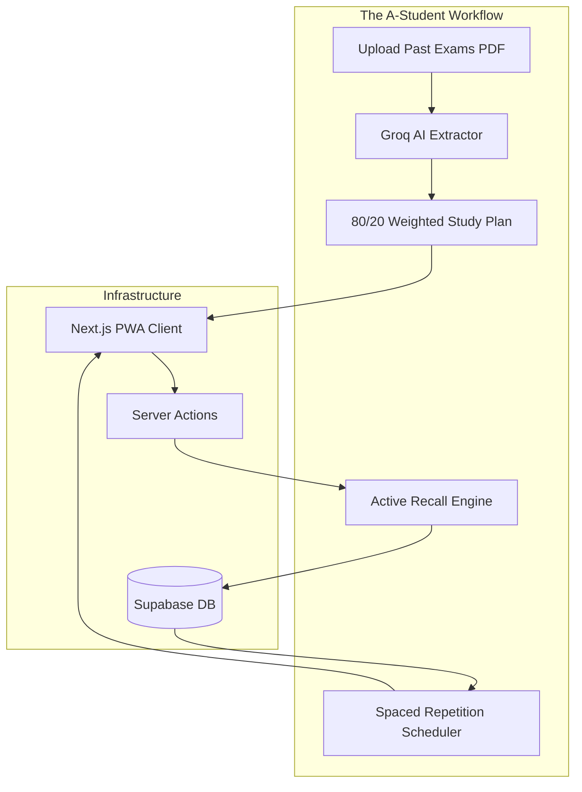

# PART A: HIGH-LEVEL DESIGN (The A-Student OS)

## A.1 System Overview
StudyPilot V3 is no longer a time-tracking application. It is an **AI-Powered Active Recall and Exam Strategy Platform**. It operates on the fundamental academic truth that *quality* of study (retention, high-yield focus, sleep) is infinitely more valuable than *quantity* (minutes studied).

### Core Features
1. **Past Exam Analyzer:** AI extraction of 80/20 high-yield topics from uploaded PDFs.
2. **Active Recall Engine:** Mandatory AI-generated flashcards/write-ups at the end of study sessions.
3. **Forgetting Curve Tracker:** Automated scheduling for spaced repetition.

### Deployment Matrix

| Component | Platform | Tech Stack | Distribution |
|-----------|----------|------------|--------------|
| Web App / PWA | Any Browser | Next.js 14 (App Router) | Vercel (Web) / "Add to Home Screen" |
| AI PDF Parser | Edge | Groq API (Mixtral 8x7B) + Langchain | Cloud Processing |
| Database | Cloud | Supabase (PostgreSQL) | Supabase Cloud |

### System Architecture Diagram



---

## A.2 The Active Recall Engine Architecture

To enforce active recall, StudyPilot employs a strict verification gate:
1. A student studies a topic (e.g., "Thermodynamics").
2. The user clicks "Log Session".
3. The Next.js API requests 3 rapid-fire questions from Groq about Thermodynamics.
4. The user must type their answers.
5. Groq evaluates the answers. **If the user fails, the session is discarded as "Passive Study."** If they pass, it is logged, and the topic enters the Spaced Repetition schedule.

---

## A.3 Technology Stack Details

```yaml
Framework: Next.js 14 (App Router)
AI Integration: Groq API (Incredible speed required for real-time recall questions)
File Handling: Next.js API Routes for PDF parsing (pdf-parse)
Styling: TailwindCSS + Shadcn UI
Database: Supabase (PostgreSQL)
```


# PART B: DATABASE SCHEMA & ONBOARDING

## B.1 Database Schema: Tracking Quality, Not Quantity

We have completely removed `total_minutes_studied` from our metrics. The database is strictly designed around the **5 Pillars of Academic Success**.

```sql
-- Profiles table
CREATE TABLE public.profiles (
    id UUID PRIMARY KEY REFERENCES auth.users(id),
    email VARCHAR(255) NOT NULL,
    full_name VARCHAR(100),
    
    -- Quality Metrics
    total_active_recall_sessions INT DEFAULT 0,
    practice_problems_solved INT DEFAULT 0,
    past_exams_analyzed INT DEFAULT 0,
    average_sleep_hours FLOAT DEFAULT 0.0,
    
    created_at TIMESTAMPTZ DEFAULT NOW()
);

-- Exam Analysis Results (The 80/20 Planner)
CREATE TABLE public.exam_topics (
    id UUID PRIMARY KEY DEFAULT gen_random_uuid(),
    user_id UUID REFERENCES profiles(id),
    topic_name VARCHAR(200) NOT NULL,
    appearance_frequency INT, -- How many times it appeared in past exams
    exam_weight_percentage FLOAT,
    user_mastery_level INT DEFAULT 0, -- 0 to 100 based on active recall success
    next_review_date DATE, -- Spaced repetition scheduling
    created_at TIMESTAMPTZ DEFAULT NOW()
);

-- Active Recall Logs
CREATE TABLE public.study_sessions (
    id UUID PRIMARY KEY DEFAULT gen_random_uuid(),
    user_id UUID REFERENCES profiles(id),
    topic_id UUID REFERENCES exam_topics(id),
    recall_score FLOAT, -- Grading provided by Groq LLM
    sleep_hours_previous_night FLOAT,
    status VARCHAR(20), -- 'PASS', 'FAIL_PASSIVE', 'PENDING'
    created_at TIMESTAMPTZ DEFAULT NOW()
);
```

---

## B.2 Onboarding Flow

Onboarding no longer focuses on timers. It focuses on gathering the raw material for academic success.

### Step 1: The Reality Check
"How much sleep did you get last night?" (Slider 0-12 hours).
*If < 7 hours: "Warning: Your memory consolidation is severely impaired today. Deep learning will be 40% less effective."*

### Step 2: Upload Past Papers
"A-Students don't read the textbook from page 1. They analyze the finish line. Upload up to 3 past exams for your hardest class."
- User uploads PDFs.
- Loading screen while Groq extracts the 80/20 topics.

### Step 3: The 80/20 Plan Revealed
"Here are the 3 topics that make up 65% of your final grade. This is your study plan."


# PART C: PROFILE & SETTINGS (Analytics Dashboard)

## C.1 Profile Page Architecture: The A-Student Dashboard

The profile page is no longer a simple settings menu. It is an advanced analytics dashboard tracking the academic health of the student.

### Key Metrics Displayed:
1. **The Forgetting Curve Health:** Visual graph showing how many topics are currently "At Risk of Forgetting" vs "Mastered".
2. **Active Recall Ratio:** Percentage of study sessions that successfully passed the AI active recall gate (Target: >85%).
3. **Sleep vs. Retention Correlation:** A scatter plot (using Recharts) mapping the user's `sleep_hours_previous_night` against their `recall_score` to visually prove that all-nighters destroy retention.

---

## C.2 Settings & Preferences

### 1. Spaced Repetition Aggressiveness
Users can configure how strictly the app enforces review periods.
- **Cram Mode (1-2 weeks out):** Reviews scheduled at 1 hour, 1 day, 3 days.
- **Maintenance Mode:** Reviews scheduled at 1 day, 1 week, 3 weeks.

### 2. Active Recall Difficulty
- **Multiple Choice:** Easy mode.
- **Short Answer:** Medium mode (Groq evaluates semantics).
- **Feynman Technique:** Hard mode. The app prompts the user to "Teach this topic to a 5-year-old via Voice Transcription."

### 3. Morning Sleep Accountability
Toggle: *Require sleep logging before unlocking today's 80/20 study plan.*


# PART D: GDPR COMPLIANCE & PRIVACY (PDF Handling)

## D.1 PDF Data Privacy Model

The core of StudyPilot V3 is the **AI Past Exam Analyzer**. This requires users to upload potentially sensitive university documents (past exam papers, syllabi, lecture slides).

### D.1.1 Zero-Retention Document Processing
To comply with GDPR and university academic integrity policies, we enforce strict data handling for uploaded files:
1. **No Permanent Storage:** Uploaded PDFs are parsed entirely in memory using Next.js Serverless Functions (or stored ephemerally in `/tmp`).
2. **Immediate Destruction:** Once the text is extracted and sent to the Groq API for 80/20 analysis, the original PDF and the raw extracted text are permanently deleted from the server.
3. **Database Storage:** The database only stores the *derived metadata* (e.g., Topic: "Thermodynamics", Frequency: 12), never the actual exam questions or university IP.

### D.1.2 LLM Privacy Agreement
Groq API is utilized as our processing sub-processor. We must explicitly opt out of data training in our API contracts. User uploaded study materials are **never** used to train models.

---

## D.2 Data Portability & The Forgetting Curve
When a user requests a GDPR data export, they receive a JSON payload containing:
- Their exact Spaced Repetition schedule.
- Their active recall success rates per topic.
- Their sleep correlation data.
This ensures complete portability of their academic profile.


# PART E: UI/UX DESIGN SYSTEM (The Academic OS)

## E.1 Core Interfaces

The user interface pivots entirely away from "stopwatches" and towards "Active Interaction."

### 1. The 80/20 Exam Analyzer View
```tsx
// ExamAnalyzer.tsx
<div className="grid grid-cols-1 md:grid-cols-2 gap-8">
  {/* Left: Upload Zone */}
  <div className="border-2 border-dashed border-gray-700 rounded-xl p-12 text-center">
    <UploadCloud className="mx-auto h-12 w-12 text-blue-500 mb-4" />
    <h3>Upload Past Papers</h3>
    <p className="text-gray-400">PDF, DOCX. Max 5 files.</p>
  </div>
  
  {/* Right: The AI Result */}
  <div className="bg-gray-900 rounded-xl p-6">
    <h3 className="font-bold text-xl text-yellow-500 flex items-center gap-2">
      <Zap /> The 80/20 High-Yield Plan
    </h3>
    <ul className="mt-4 space-y-4">
      {topics.map(topic => (
        <li className="flex justify-between items-center border-b border-gray-800 pb-2">
          <span>{topic.name}</span>
          <Badge variant="destructive">{topic.weight}% of Exam</Badge>
        </li>
      ))}
    </ul>
  </div>
</div>
```

### 2. The Active Recall Gate
This is the most critical UI component. It replaces the "End Session" button.

```tsx
// ActiveRecallGate.tsx
<div className="fixed inset-0 bg-black/90 z-50 flex items-center justify-center p-4">
  <div className="bg-gray-900 max-w-2xl w-full rounded-2xl p-8">
    <h2 className="text-2xl font-bold mb-2">Wait! Don't close the book yet.</h2>
    <p className="text-gray-400 mb-6">To log this session, prove what you learned about <b>{currentTopic}</b>.</p>
    
    <div className="space-y-6">
      <div>
        <p className="font-medium text-blue-400 mb-2">Q: {groqGeneratedQuestion}</p>
        <Textarea 
          placeholder="Explain it like I'm 5..."
          className="min-h-[150px] text-lg"
        />
      </div>
      
      <Button size="lg" className="w-full">
        Submit for AI Grading
      </Button>
    </div>
  </div>
</div>
```

## E.2 Typography & Psychology
- We replace stress-inducing red colors with calm, authoritative blues and academic purples.
- We remove all countdown visual stress (no ticking numbers). Focus is entirely on the *content* of the screen, not the clock.


# PART F: IMPLEMENTATION ROADMAP (V3 MVP Sprint)

The 6-week timeline has been re-architected. We are no longer building a bulletproof offline timer. We are building the **AI-Powered Active Recall Platform**.

## Phase 1: The 80/20 AI Analyzer (Weeks 1-2)
**Goal: Build the feature that makes students say "Wow."**
- **Week 1:** Next.js App Router setup, Supabase Auth. Build the PDF Upload UI component with drag-and-drop.
- **Week 2:** Integrate `pdf-parse` in Next.js Server Actions. Connect to **Groq API (Mixtral)** with strict prompt engineering to extract topics, calculate frequencies, and output JSON arrays of the highest-yield subjects.

## Phase 2: The Active Recall Engine (Weeks 3-4)
**Goal: Enforce quality studying.**
- **Week 3:** Build the "Active Recall Gate" UI. When a user marks a topic as "Studied", trigger Groq to instantly generate 3 short-answer questions based on the topic name and uploaded PDF context.
- **Week 4:** Implement the LLM Grading logic. Groq evaluates the student's text input against the correct concepts. If passing, write to the database and calculate the first Spaced Repetition interval.

## Phase 3: Sleep & Spaced Repetition (Weeks 5-6)
**Goal: The long-term retention loop.**
- **Week 5:** Build the Dashboard Analytics. Display the Forgetting Curve and the correlation between the user's logged sleep hours and their active recall success rates.
- **Week 6:** Implement VAPID Web Push notifications to ping users when a topic hits the 1-day, 3-day, or 1-week review window. Final deployment to Vercel.


# PART G: MONETIZATION & ACQUISITION STRATEGY

## 1. The Value Proposition Pivot

StudyPilot V3 is infinitely easier to market than a timer app. 
- **Old Pitch:** "Track your focus time." (Boring, commoditized).
- **New Pitch:** "Upload your past exams, get the 80/20 cheat sheet, and use AI active recall to guarantee an A." (Irresistible).

---

## 2. Freemium Pricing Model

While the timer was 100% free, **AI Inference (Groq) costs money.** We must restructure the pricing to be sustainable while remaining highly accessible to students.

### The "A-Student" Free Tier
- **1 Past Exam Analysis per month**
- **Unlimited manual topic logging**
- **3 AI Active Recall sessions per day**
- Sleep tracking & Spaced Repetition scheduling

### The "Dean's List" Pro Tier ($4.99/mo or $39/year)
- **Unlimited PDF Exam Uploads & Analysis**
- **Unlimited AI Active Recall grading**
- **Feynman Technique Voice transcription**
- **Custom AI-generated practice exams**

---

## 3. University Partnerships (B2B)

The B2B pitch to universities changes entirely:
We aren't selling a "wellness tracker" (which IT departments hate). We are selling an **AI Tutoring & Retention Platform**.

| Feature | Student (Pro) | University License |
|---------|---------------|-------------------|
| AI Active Recall | ✅ | ✅ |
| Past Paper Analysis | ✅ | ✅ |
| **Course-level Analytics** | ❌ | ✅ (Professors see which topics the entire class is failing the active recall gate on) |
| **LMS Integration** | ❌ | ✅ (Automatically pulls syllabus from Canvas to generate the 80/20 plan) |


# PART H: EXAM CRISIS MODE (V3 Implementation)

## 1. The Brutal Truth About Crisis Mode

In previous versions, "Crisis Mode" was a timer with red alarms. As the "A-Student Blueprint" review pointed out, **a timer won't save you 24 hours before an exam.** Only high-yield active recall can save you.

## 2. Crisis Mode Protocol (The 24-Hour Save)

When a student clicks the "Crisis Mode" button (indicating an exam is <48 hours away), StudyPilot initiates an extreme academic triage protocol.

### Step 1: The Triage Cut
- The AI completely drops all topics that have less than a 10% exam weight.
- The UI brutally informs the student: *"You do not have time to learn Thermodynamics. We are abandoning it. Focus 100% on Electricity (37% weight) to pass."*

### Step 2: Pure Active Recall (No Reading Allowed)
- Passive reading is banned. 
- Crisis Mode locks the UI into a pure flashcard/practice problem interface. 
- The user is bombarded with AI-generated practice questions specifically targeting their "High-Weight / Low-Confidence" topics.

### Step 3: The Hard Sleep Stop
- 10:00 PM the night before the exam.
- The app locks the active recall engine.
- **Message:** *"Studying all night actively destroys your retrieval ability. You will score 20% lower tomorrow if you don't sleep right now. Go to bed."*
- If the user overrides it, the app explicitly logs the failure and predicts a grade penalty.

---

## 3. The 7-Day Protocol Tracker

For students starting a week out, the Dashboard transforms into the 7-Day Checklist:

- `[ ]` **Day 7:** Take full practice exam (Upload results to StudyPilot for weak-spot analysis)
- `[ ]` **Day 6-4:** Targeted Active Recall on weak spots only
- `[ ]` **Day 3-2:** No new material. Re-test missed practice questions.
- `[ ]` **Day 1:** Light review. Sleep 8+ hours.


